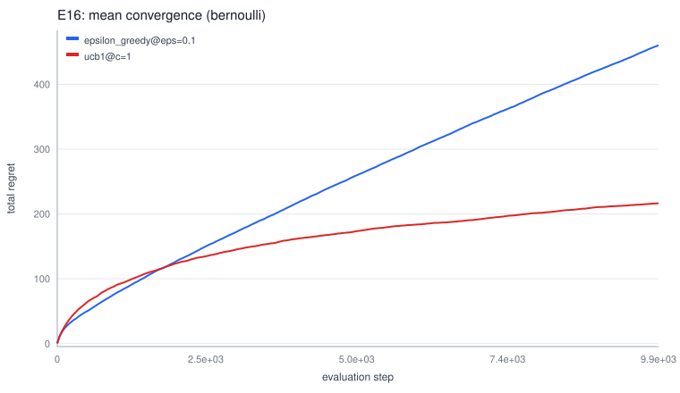
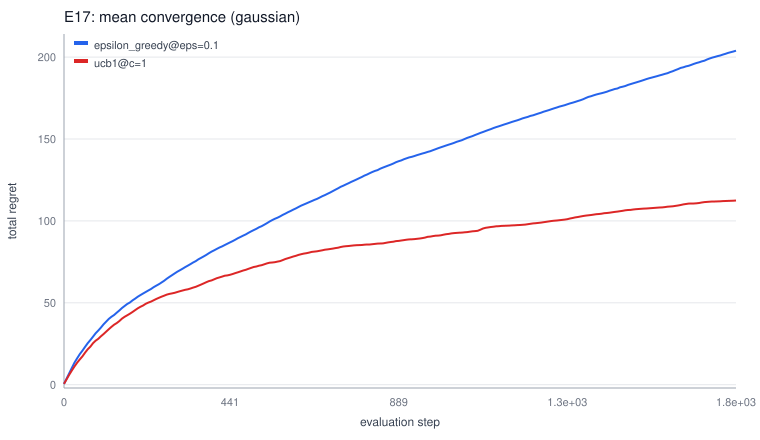
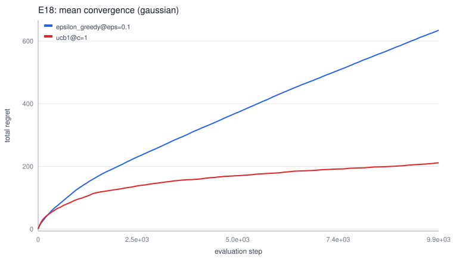
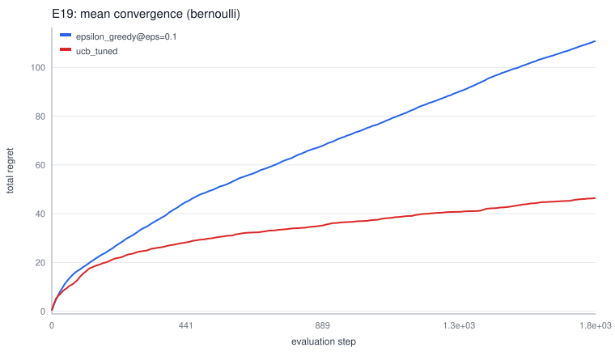
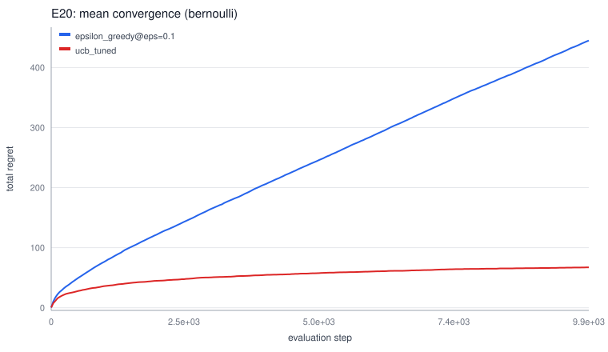
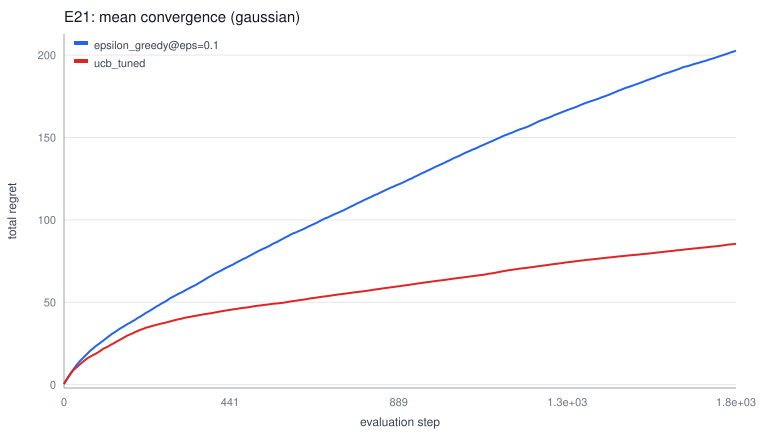
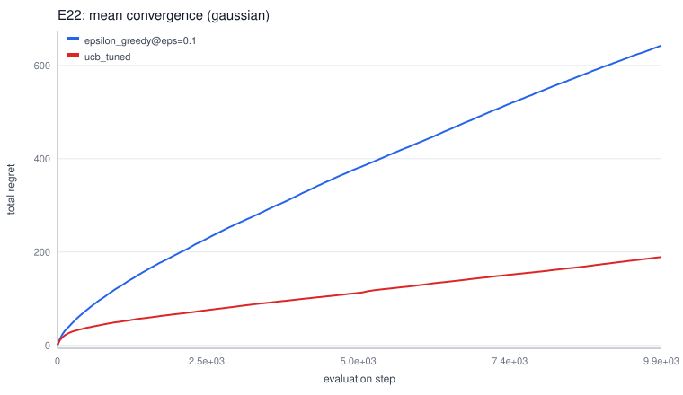

# An Autonomous Investigation of Which exploration policy minimizes cumulative regret on stochastic K-armed bandits, and how do policy parameters, arm difficulty and horizon length change that ranking

*Research session* `rs_3569jzgjaw8z` · domain `bandit` · git commit `d6b1eb9e80`

> **Evidence policy.** All numbers below are extracted programmatically from this session's experiment database. Each experimental statement cites the experiment IDs that support it. Hypothesis prose was produced by the lab's deterministic 'heuristic' reasoning layer.

## Abstract

This report documents an autonomous computational research session investigating: *Which exploration policy minimizes cumulative regret on stochastic K-armed bandits, and how do policy parameters, arm difficulty and horizon length change that ranking?*. The system executed 20 experiments (1290 seeded runs) to test 22 hypotheses through an iterative propose–design–execute–analyze–critique loop. Of the tested hypotheses, 16 were supported and 2 were refuted by their falsification tests; the remainder were inconclusive or superseded. The strongest configuration observed was `thompson_bernoulli@prior_strength=1` (mean total_regret=33.77; experiment `ex_1693bwx5c8b0`).

## Introduction

The research question for this session is:

> Which exploration policy minimizes cumulative regret on stochastic K-armed bandits, and how do policy parameters, arm difficulty and horizon length change that ranking?

Rather than generating survey prose, the lab answers this question empirically: it maintains hypotheses with explicit falsification conditions, converts each into a paired-seed Monte-Carlo experiment, executes the experiment code inside isolated sandboxed processes, and subjects every conclusion to an adversarial critic pass before it may stand.

## Related Work

[S1] **Finite-time Analysis of the Multiarmed Bandit Problem** — Peter Auer, Nicolo Cesa-Bianchi, Paul Fischer, 2002. [link](https://doi.org/10.1023/A:1013689704352)  
*(seed_corpus; relevance 0.2804)*

[S2] **Differential Evolution – A Simple and Efficient Heuristic for Global Optimization over Continuous Spaces** — Rainer Storn, Kenneth Price, 1997. [link](https://doi.org/10.1023/A:1008202821328)  
*(seed_corpus; relevance 0.11)*

[S3] **The Reinforcement Learning problem: exploration vs exploitation** — Richard S. Sutton, Andrew G. Barto, 2018. [link](https://mitpress.mit.edu/9780262039246/reinforcement-learning/)  
*(seed_corpus; relevance 0.1001)*

[S4] **A Tutorial on Thompson Sampling** — Daniel J. Russo, Benjamin Van Roy, Abbas Kazerouni et al., 2018. [link](https://arxiv.org/abs/1707.02038)  
*(seed_corpus; relevance 0.0842)*

[S5] **Open Problem: Better Regret for Interval Bandits (and empirical gaps)** — Placeholder compiled entry, 2016.  
*(seed_corpus; relevance 0.0654)*

[S6] **Empirical comparison of derivative-free optimizers under evaluation budgets** — Compiled entry summarizing BBOB practice, 2012.  
*(seed_corpus; relevance 0.0261)*

[S7] **Comparison-based parameter tuning heuristics: simulated annealing schedules** — Compiled entry summarizing SA schedule literature, 2004.  
*(seed_corpus; relevance 0.0)*

[S8] **No Free Lunch Theorems for Optimization** — David H. Wolpert, William G. Macready, 1997. [link](https://doi.org/10.1109/4105.585893)  
*(seed_corpus; relevance 0.0)*

## Hypotheses

### H1 [SUPPORTED]

- **Claim:** On Bernoulli bandits with a visible gap (gap_min >= 0.1), UCB1(c=1) achieves lower mean total regret than the epsilon-greedy(0.1) baseline at horizon T=5000.
- **Reasoning:** UCB1's exploration bonus shrinks as O(sqrt(log t / n_i)) while fixed-eps keeps paying linear regret eps*Delta*T forever; literature predicts asymptotic superiority which should already be measurable at T=5000.
- **Expected result:** Mean total regret of UCB1 < baseline by >= 30%, p < 0.05.
- **Falsification condition:** UCB1 mean regret >= baseline mean regret, or paired-bootstrap CI of the difference includes zero.
- **Post-hoc confidence score:** 0.903
- **Origin:** initial

### H2 [SUPPORTED]

- **Claim:** Thompson sampling (Beta prior) dominates UCB1(c=1) on hard-gap Bernoulli bandits (gap_min >= 0.2) at short horizons (T=2000).
- **Reasoning:** Posterior sampling adapts exploration to remaining uncertainty; on hard gaps where few arms look similar, adaptive methods are reported to reach near-oracle behavior faster than UCB bonuses.
- **Expected result:** Thompson mean regret < UCB1 mean regret by >= 15%.
- **Falsification condition:** No significant regret reduction (paired-bootstrap CI includes zero after Holm correction across the comparison family).
- **Post-hoc confidence score:** 0.95
- **Origin:** initial

### H3 [REFUTED]

- **Claim:** Tuning c materially changes ucb1 performance: at least one of ['ucb1@c=0.25', 'ucb1@c=0.5', 'ucb1@c=2'] beats the incumbent setting (ucb1@c=1, mean 165.9).
- **Reasoning:** Sensitivity sweeps around a champion quantify how much of the advantage is parameter luck vs method property.
- **Expected result:** A monotone or U-shaped response in c; best swept value improves mean total_regret by >5%.
- **Falsification condition:** All swept values within noise of incumbent (all CIs include 0).
- **Post-hoc confidence score:** 0.491
- **Origin:** prior_result

### H4 [SUPPORTED]

- **Claim:** The champion's advantage transfers to bernoulli at T=10000 without retuning.
- **Reasoning:** An effect that only holds in its original setting is fragile; transfer tests are the cheapest falsification attempt available.
- **Expected result:** ucb1@c=0.5 still ranks above baseline.
- **Falsification condition:** ucb1@c=0.5 no better than baseline on bernoulli (T=10000); CI of difference includes 0 or reverses.
- **Post-hoc confidence score:** 0.95
- **Origin:** prior_result

### H5 [SUPPORTED]

- **Claim:** The champion's advantage transfers to gaussian at T=2000 without retuning.
- **Reasoning:** An effect that only holds in its original setting is fragile; transfer tests are the cheapest falsification attempt available.
- **Expected result:** ucb1@c=0.5 still ranks above baseline.
- **Falsification condition:** ucb1@c=0.5 no better than baseline on gaussian (T=2000); CI of difference includes 0 or reverses.
- **Post-hoc confidence score:** 0.729
- **Origin:** prior_result

### H6 [SUPPORTED]

- **Claim:** The champion's advantage transfers to gaussian at T=10000 without retuning.
- **Reasoning:** An effect that only holds in its original setting is fragile; transfer tests are the cheapest falsification attempt available.
- **Expected result:** ucb1@c=0.5 still ranks above baseline.
- **Falsification condition:** ucb1@c=0.5 no better than baseline on gaussian (T=10000); CI of difference includes 0 or reverses.
- **Post-hoc confidence score:** 0.882
- **Origin:** prior_result

### H7 [INCONCLUSIVE]

- **Claim:** ucb_tuned challenges champion ucb1@c=0.5 on its own home ground (bernoulli, bernoulli@5000).
- **Reasoning:** ucb_tuned uses a distinct exploration mechanism from every method tried so far; a direct match tests whether the current ranking reflects method class or specific implementation.
- **Expected result:** ucb_tuned either surpasses the champion by >10% or loses by >20% - an informative outcome either way.
- **Falsification condition:** Ambiguous near-tie (CI includes 0) would leave the ranking unresolved and trigger a replication.
- **Post-hoc confidence score:** 0.5
- **Origin:** prior_result

### H8 [TESTING]

- **Claim:** thompson_gaussian challenges champion ucb1@c=0.5 on its own home ground (bernoulli, bernoulli@5000).
- **Reasoning:** thompson_gaussian uses a distinct exploration mechanism from every method tried so far; a direct match tests whether the current ranking reflects method class or specific implementation.
- **Expected result:** thompson_gaussian either surpasses the champion by >10% or loses by >20% - an informative outcome either way.
- **Falsification condition:** Ambiguous near-tie (CI includes 0) would leave the ranking unresolved and trigger a replication.
- **Post-hoc confidence score:** 0.5
- **Origin:** prior_result

### H9 [SUPPORTED]

- **Claim:** optimistic_greedy@init_value=1 challenges champion ucb1@c=0.5 on its own home ground (bernoulli, bernoulli@5000).
- **Reasoning:** optimistic_greedy uses a distinct exploration mechanism from every method tried so far; a direct match tests whether the current ranking reflects method class or specific implementation.
- **Expected result:** optimistic_greedy@init_value=1 either surpasses the champion by >10% or loses by >20% - an informative outcome either way.
- **Falsification condition:** Ambiguous near-tie (CI includes 0) would leave the ranking unresolved and trigger a replication.
- **Post-hoc confidence score:** 0.737
- **Origin:** prior_result

### H10 [SUPPORTED]

- **Claim:** Under escalated difficulty (T=10000), the champion-vs-rival ordering persists: ucb1@c=0.5 stays ahead of optimistic_greedy@init_value=1.
- **Reasoning:** Harder settings amplify method differences; robust rankings survive escalation while brittle ones invert.
- **Expected result:** ucb1@c=0.5 retains its lead (CI excludes 0).
- **Falsification condition:** optimistic_greedy@init_value=1 overtakes ucb1@c=0.5.
- **Post-hoc confidence score:** 0.664
- **Origin:** prior_result

### H11 [SUPPORTED]

- **Claim:** Replication check: ucb1@c=0.5's observed standing (mean 46.86 on bernoulli/bernoulli@5000) remains statistically stable under a larger sample.
- **Reasoning:** The critic flagged SMALL_SAMPLE on the prior comparison; a replication at increased n both re-estimates the effect and tightens its confidence interval.
- **Expected result:** Same ranking direction with CI excluding zero.
- **Falsification condition:** Ranking flips or CI includes zero at larger n.
- **Post-hoc confidence score:** 0.95
- **Origin:** prior_result

### H12 [SUPPORTED]

- **Claim:** Under escalated difficulty (T=10000), the champion-vs-rival ordering persists: ucb1@c=0.5 stays ahead of epsilon_greedy@eps=0.1.
- **Reasoning:** Harder settings amplify method differences; robust rankings survive escalation while brittle ones invert.
- **Expected result:** ucb1@c=0.5 retains its lead (CI excludes 0).
- **Falsification condition:** epsilon_greedy@eps=0.1 overtakes ucb1@c=0.5.
- **Post-hoc confidence score:** 0.95
- **Origin:** prior_result

### H13 [SUPERSEDED]

- **Claim:** Under escalated difficulty (T=10000), the champion-vs-rival ordering persists: ucb1@c=0.5 stays ahead of epsilon_greedy@eps=0.1.
- **Reasoning:** Harder settings amplify method differences; robust rankings survive escalation while brittle ones invert.
- **Expected result:** ucb1@c=0.5 retains its lead (CI excludes 0).
- **Falsification condition:** epsilon_greedy@eps=0.1 overtakes ucb1@c=0.5.
- **Origin:** prior_result

### H14 [REFUTED]

- **Claim:** Open-cell exploration: ucb1@c=1 on bernoulli @ T=2000 beats the baseline (epsilon_greedy@eps=0.1). Motivated by literature gap: Literature coverage is thin on 'policy'.
- **Reasoning:** Systematic coverage of the configuration space guards against converging prematurely on a local region of method space.
- **Expected result:** ucb1@c=1 improves on baseline mean total_regret.
- **Falsification condition:** Baseline equal or better (CI excludes improvement).
- **Post-hoc confidence score:** 0.409
- **Origin:** prior_result

### H15 [SUPERSEDED]

- **Claim:** Replication check: ucb1@c=0.5's observed standing (mean 46.86 on bernoulli/bernoulli@5000) remains statistically stable under a larger sample.
- **Reasoning:** The critic flagged SMALL_SAMPLE on the prior comparison; a replication at increased n both re-estimates the effect and tightens its confidence interval.
- **Expected result:** Same ranking direction with CI excluding zero.
- **Falsification condition:** Ranking flips or CI includes zero at larger n.
- **Origin:** prior_result

### H16 [SUPPORTED]

- **Claim:** Open-cell exploration: ucb1@c=1 on bernoulli @ T=10000 beats the baseline (epsilon_greedy@eps=0.1). Motivated by literature gap: Literature coverage is thin on 'policy'.
- **Reasoning:** Systematic coverage of the configuration space guards against converging prematurely on a local region of method space.
- **Expected result:** ucb1@c=1 improves on baseline mean total_regret.
- **Falsification condition:** Baseline equal or better (CI excludes improvement).
- **Post-hoc confidence score:** 0.95
- **Origin:** prior_result

### H17 [SUPPORTED]

- **Claim:** Open-cell exploration: ucb1@c=1 on gaussian @ T=2000 beats the baseline (epsilon_greedy@eps=0.1). Motivated by literature gap: Literature coverage is thin on 'policy'.
- **Reasoning:** Systematic coverage of the configuration space guards against converging prematurely on a local region of method space.
- **Expected result:** ucb1@c=1 improves on baseline mean total_regret.
- **Falsification condition:** Baseline equal or better (CI excludes improvement).
- **Post-hoc confidence score:** 0.817
- **Origin:** prior_result

### H18 [SUPPORTED]

- **Claim:** Open-cell exploration: ucb1@c=1 on gaussian @ T=10000 beats the baseline (epsilon_greedy@eps=0.1). Motivated by literature gap: Literature coverage is thin on 'policy'.
- **Reasoning:** Systematic coverage of the configuration space guards against converging prematurely on a local region of method space.
- **Expected result:** ucb1@c=1 improves on baseline mean total_regret.
- **Falsification condition:** Baseline equal or better (CI excludes improvement).
- **Post-hoc confidence score:** 0.936
- **Origin:** prior_result

### H19 [SUPPORTED]

- **Claim:** Open-cell exploration: ucb_tuned on bernoulli @ T=2000 beats the baseline (epsilon_greedy@eps=0.1). Motivated by literature gap: Literature coverage is thin on 'policy'.
- **Reasoning:** Systematic coverage of the configuration space guards against converging prematurely on a local region of method space.
- **Expected result:** ucb_tuned improves on baseline mean total_regret.
- **Falsification condition:** Baseline equal or better (CI excludes improvement).
- **Post-hoc confidence score:** 0.95
- **Origin:** prior_result

### H20 [SUPPORTED]

- **Claim:** Open-cell exploration: ucb_tuned on bernoulli @ T=10000 beats the baseline (epsilon_greedy@eps=0.1). Motivated by literature gap: Literature coverage is thin on 'policy'.
- **Reasoning:** Systematic coverage of the configuration space guards against converging prematurely on a local region of method space.
- **Expected result:** ucb_tuned improves on baseline mean total_regret.
- **Falsification condition:** Baseline equal or better (CI excludes improvement).
- **Post-hoc confidence score:** 0.95
- **Origin:** prior_result

### H21 [SUPPORTED]

- **Claim:** Open-cell exploration: ucb_tuned on gaussian @ T=2000 beats the baseline (epsilon_greedy@eps=0.1). Motivated by literature gap: Literature coverage is thin on 'policy'.
- **Reasoning:** Systematic coverage of the configuration space guards against converging prematurely on a local region of method space.
- **Expected result:** ucb_tuned improves on baseline mean total_regret.
- **Falsification condition:** Baseline equal or better (CI excludes improvement).
- **Post-hoc confidence score:** 0.743
- **Origin:** prior_result

### H22 [SUPPORTED]

- **Claim:** Open-cell exploration: ucb_tuned on gaussian @ T=10000 beats the baseline (epsilon_greedy@eps=0.1). Motivated by literature gap: Literature coverage is thin on 'policy'.
- **Reasoning:** Systematic coverage of the configuration space guards against converging prematurely on a local region of method space.
- **Expected result:** ucb_tuned improves on baseline mean total_regret.
- **Falsification condition:** Baseline equal or better (CI excludes improvement).
- **Post-hoc confidence score:** 0.892
- **Origin:** prior_result

## Methodology

**Design.** Experiments use common random numbers: every configuration in an experiment shares one seed set, so comparisons are paired by seed. Default repetitions per configuration: 30 (replications raised automatically when the critic demanded more power).

**Execution isolation.** Each run executes as its own OS process (`python -I`) with CPU-time/file-size rlimits, sanitized environment, and hard wall-clock kill. The kernel code bundled into each run is content-hashed (`code_version`); configurations are canonical-JSON hashed (`spec_hash`) so identical experiments are never silently re-run.

**Statistics.** Paired t-tests as primary test; Mann-Whitney U as a rank-based robustness check; paired bootstrap 95% CIs for effect sizes (2000 resamples, deterministic seeds); Holm step-down correction across each comparison family. Effect size is Cohen's d oriented as `mean(reference) - mean(variant)`.

**Reproducibility audit.** The critic re-executes sampled runs from scratch and compares result hashes byte-for-byte.

## Experiments and Results

### E1 — `ex_3965eakc9p29`

- Task: `bernoulli` (bernoulli@5000); variants: `epsilon_greedy@eps=0.1`, `ucb1@c=1`
- Seeds: 30 per variant (root seed `2868158132`); status: **COMPLETED**
- Predicted winner: `ucb1@c=1`

| Variant | mean | sd |
|---|---|---|
| `ucb1@c=1` | 165.9 | 29.9 |
| `epsilon_greedy@eps=0.1` | 236.8 | 54.5 |

`ucb1@c=1` vs reference `epsilon_greedy@eps=0.1`: Δ(mean_b−mean_a)=+70.91, CI95=[+48.99, +93.65], adjusted p=1.46e-06, d=1.61 → **significant** (n=30/variant; `paired_t(df=29)`).

*(evidence: `ex_3965eakc9p29`)*

**Critic verdict: ACCEPT** (findings: SINGLE_COMPARATOR; reproducibility check: passed).

### E2 — `ex_1693bwx5c8b0`

- Task: `bernoulli` (bernoulli@2000); variants: `thompson_bernoulli@prior_strength=1`, `ucb1@c=1`
- Seeds: 30 per variant (root seed `2731698039`); status: **COMPLETED**
- Predicted winner: `thompson_bernoulli@prior_strength=1`

| Variant | mean | sd |
|---|---|---|
| `thompson_bernoulli@prior_strength=1` | 33.77 | 10.5 |
| `ucb1@c=1` | 116.9 | 17.3 |

`ucb1@c=1` vs reference `thompson_bernoulli@prior_strength=1`: Δ(mean_b−mean_a)=-83.1, CI95=[-88.83, -77.29], adjusted p=2.2e-22, d=-5.81 → **significant** (n=30/variant; `paired_t(df=29)`).

*(evidence: `ex_1693bwx5c8b0`)*

**Critic verdict: ACCEPT** (findings: SINGLE_COMPARATOR; reproducibility check: passed).

### E3 — `ex_2719m3kz16g0`

- Task: `bernoulli` (bernoulli@5000); variants: `ucb1@c=0.25`, `ucb1@c=0.5`, `ucb1@c=2`
- Seeds: 30 per variant (root seed `2917109232`); status: **COMPLETED**
- Predicted winner: `ucb1@c=0.25`

| Variant | mean | sd |
|---|---|---|
| `ucb1@c=0.5` | 50.2 | 15.4 |
| `ucb1@c=0.25` | 56.27 | 187 |
| `ucb1@c=2` | 484.7 | 45.2 |

`ucb1@c=0.5` vs reference `ucb1@c=0.25`: Δ(mean_b−mean_a)=+6.076, CI95=[-34.22, +79.7], adjusted p=0.861, d=0.05 → **not significant** (n=30/variant; `paired_t(df=29)`).

*(evidence: `ex_2719m3kz16g0`)*

`ucb1@c=2` vs reference `ucb1@c=0.25`: Δ(mean_b−mean_a)=-428.4, CI95=[-473.1, -355.5], adjusted p=6.08e-13, d=-3.14 → **significant** (n=30/variant; `paired_t(df=29)`).

*(evidence: `ex_2719m3kz16g0`)*

**Critic verdict: REJECT** (findings: CI_INCLUDES_ZERO, WRONG_DIRECTION, NEGLIGIBLE_EFFECT; reproducibility check: passed).

### E4 — `ex_9942x4k0dmwn`

- Task: `bernoulli` (bernoulli@10000); variants: `epsilon_greedy@eps=0.1`, `ucb1@c=0.5`
- Seeds: 30 per variant (root seed `3106254066`); status: **COMPLETED**
- Predicted winner: `ucb1@c=0.5`

| Variant | mean | sd |
|---|---|---|
| `ucb1@c=0.5` | 68.44 | 24.7 |
| `epsilon_greedy@eps=0.1` | 425.5 | 114 |

`ucb1@c=0.5` vs reference `epsilon_greedy@eps=0.1`: Δ(mean_b−mean_a)=+357.1, CI95=[+316.3, +398.9], adjusted p=2.91e-16, d=4.34 → **significant** (n=30/variant; `paired_t(df=29)`).

*(evidence: `ex_9942x4k0dmwn`)*

**Critic verdict: ACCEPT** (findings: SINGLE_COMPARATOR; reproducibility check: passed).

### E5 — `ex_731822sc8548`

- Task: `gaussian` (gaussian@2000); variants: `epsilon_greedy@eps=0.1`, `ucb1@c=0.5`
- Seeds: 30 per variant (root seed `4101122474`); status: **COMPLETED**
- Predicted winner: `ucb1@c=0.5`

| Variant | mean | sd |
|---|---|---|
| `ucb1@c=0.5` | 101.4 | 97.9 |
| `epsilon_greedy@eps=0.1` | 181.7 | 76.3 |

`ucb1@c=0.5` vs reference `epsilon_greedy@eps=0.1`: Δ(mean_b−mean_a)=+80.3, CI95=[+44.68, +114.6], adjusted p=0.000105, d=0.92 → **significant** (n=30/variant; `paired_t(df=29)`).

*(evidence: `ex_731822sc8548`)*

**Critic verdict: ACCEPT** (findings: SINGLE_COMPARATOR; reproducibility check: passed).

### E6 — `ex_1634vfdetrv8`

- Task: `gaussian` (gaussian@10000); variants: `epsilon_greedy@eps=0.1`, `ucb1@c=0.5`
- Seeds: 30 per variant (root seed `2650425298`); status: **COMPLETED**
- Predicted winner: `ucb1@c=0.5`

| Variant | mean | sd |
|---|---|---|
| `ucb1@c=0.5` | 174.2 | 247 |
| `epsilon_greedy@eps=0.1` | 598.4 | 306 |

`ucb1@c=0.5` vs reference `epsilon_greedy@eps=0.1`: Δ(mean_b−mean_a)=+424.2, CI95=[+286.3, +566.6], adjusted p=4.11e-06, d=1.53 → **significant** (n=30/variant; `paired_t(df=29)`).

*(evidence: `ex_1634vfdetrv8`)*

**Critic verdict: ACCEPT** (findings: SINGLE_COMPARATOR; reproducibility check: passed).

### E7 — `ex_8819w4s0swrm`

- Task: `bernoulli` (bernoulli@5000); variants: `ucb1@c=0.5`, `ucb_tuned`
- Seeds: 30 per variant (root seed `1622482143`); status: **COMPLETED**

| Variant | mean | sd |
|---|---|---|
| `ucb1@c=0.5` | 46.86 | 12.1 |
| `ucb_tuned` | 47.07 | 11.1 |

`ucb_tuned` vs reference `ucb1@c=0.5`: Δ(mean_b−mean_a)=-0.208, CI95=[-3.731, +3.241], adjusted p=0.91, d=-0.02 → **not significant** (n=30/variant; `paired_t(df=29)`).

*(evidence: `ex_8819w4s0swrm`)*

**Critic verdict: REVISE** (findings: CI_INCLUDES_ZERO, NEGLIGIBLE_EFFECT, SINGLE_COMPARATOR; reproducibility check: passed).

### E8 — `ex_0482qkg5zq8w`

- Task: `bernoulli` (bernoulli@5000); variants: `thompson_gaussian`, `ucb1@c=0.5`
- Seeds: 30 per variant (root seed `2659321425`); status: **COMPLETED**

| Variant | mean | sd |
|---|---|---|
| `ucb1@c=0.5` | 49.03 | 12.9 |
| `thompson_gaussian` | 190.2 | 29.1 |

`ucb1@c=0.5` vs reference `thompson_gaussian`: Δ(mean_b−mean_a)=+141.2, CI95=[+131.9, +151.1], adjusted p=5.58e-23, d=6.27 → **significant** (n=30/variant; `paired_t(df=29)`).

*(evidence: `ex_0482qkg5zq8w`)*

**Critic verdict: REVISE** (findings: SINGLE_COMPARATOR, SCOPE_OVERREACH; reproducibility check: passed).

### E9 — `ex_3104f5zenq5p`

- Task: `bernoulli` (bernoulli@5000); variants: `optimistic_greedy@init_value=1`, `ucb1@c=0.5`
- Seeds: 30 per variant (root seed `1548244721`); status: **COMPLETED**

| Variant | mean | sd |
|---|---|---|
| `ucb1@c=0.5` | 49.81 | 13.6 |
| `optimistic_greedy@init_value=1` | 344.7 | 440 |

`ucb1@c=0.5` vs reference `optimistic_greedy@init_value=1`: Δ(mean_b−mean_a)=+294.9, CI95=[+147.6, +456], adjusted p=0.00098, d=0.95 → **significant** (n=30/variant; `paired_t(df=29)`).

*(evidence: `ex_3104f5zenq5p`)*

**Critic verdict: ACCEPT** (findings: SINGLE_COMPARATOR; reproducibility check: passed).

### E10 — `ex_2223rp5sba6c`

- Task: `bernoulli` (bernoulli@10000); variants: `optimistic_greedy@init_value=1`, `ucb1@c=0.5`
- Seeds: 30 per variant (root seed `2570101411`); status: **COMPLETED**
- Predicted winner: `ucb1@c=0.5`

| Variant | mean | sd |
|---|---|---|
| `ucb1@c=0.5` | 53.48 | 20.2 |
| `optimistic_greedy@init_value=1` | 598.8 | 1.17e+03 |

`ucb1@c=0.5` vs reference `optimistic_greedy@init_value=1`: Δ(mean_b−mean_a)=+545.3, CI95=[+166.6, +983.1], adjusted p=0.0169, d=0.66 → **significant** (n=30/variant; `paired_t(df=29)`).

*(evidence: `ex_2223rp5sba6c`)*

**Critic verdict: ACCEPT** (findings: SMALL_SAMPLE, SINGLE_COMPARATOR; reproducibility check: passed).

### E11 — `ex_5179aqbfpgm5`

- Task: `bernoulli` (bernoulli@5000); variants: `epsilon_greedy@eps=0.1`, `ucb1@c=0.5`
- Seeds: 60 per variant (root seed `118657740`); status: **COMPLETED**
- Predicted winner: `ucb1@c=0.5`

| Variant | mean | sd |
|---|---|---|
| `ucb1@c=0.5` | 51.06 | 15.8 |
| `epsilon_greedy@eps=0.1` | 265.8 | 86.1 |

`ucb1@c=0.5` vs reference `epsilon_greedy@eps=0.1`: Δ(mean_b−mean_a)=+214.7, CI95=[+193.2, +238.8], adjusted p=4.43e-26, d=3.47 → **significant** (n=60/variant; `paired_t(df=59)`).

*(evidence: `ex_5179aqbfpgm5`)*

**Critic verdict: ACCEPT** (findings: SINGLE_COMPARATOR; reproducibility check: passed).

### E12 — `ex_3051bp3bq0fe`

- Task: `bernoulli` (bernoulli@10000); variants: `epsilon_greedy@eps=0.1`, `ucb1@c=0.5`
- Seeds: 30 per variant (root seed `2383763705`); status: **COMPLETED**
- Predicted winner: `ucb1@c=0.5`

| Variant | mean | sd |
|---|---|---|
| `ucb1@c=0.5` | 52.94 | 14.1 |
| `epsilon_greedy@eps=0.1` | 462.7 | 90.3 |

`ucb1@c=0.5` vs reference `epsilon_greedy@eps=0.1`: Δ(mean_b−mean_a)=+409.8, CI95=[+379.2, +446.1], adjusted p=1.23e-20, d=6.34 → **significant** (n=30/variant; `paired_t(df=29)`).

*(evidence: `ex_3051bp3bq0fe`)*

**Critic verdict: ACCEPT** (findings: SINGLE_COMPARATOR; reproducibility check: passed).

### E14 — `ex_1384ankpmj9n`

- Task: `bernoulli` (bernoulli@2000); variants: `epsilon_greedy@eps=0.1`, `ucb1@c=1`
- Seeds: 30 per variant (root seed `22246081`); status: **COMPLETED**
- Predicted winner: `ucb1@c=1`

| Variant | mean | sd |
|---|---|---|
| `epsilon_greedy@eps=0.1` | 110.5 | 36.9 |
| `ucb1@c=1` | 124.1 | 20.1 |

`ucb1@c=1` vs reference `epsilon_greedy@eps=0.1`: Δ(mean_b−mean_a)=-13.56, CI95=[-28.6, +2.861], adjusted p=0.112, d=-0.46 → **not significant** (n=30/variant; `paired_t(df=29)`).

*(evidence: `ex_1384ankpmj9n`)*

**Critic verdict: REJECT** (findings: CI_INCLUDES_ZERO, WRONG_DIRECTION, SMALL_SAMPLE, SINGLE_COMPARATOR; reproducibility check: passed).

### E16 — `ex_94266nq6ck2f`

- Task: `bernoulli` (bernoulli@10000); variants: `epsilon_greedy@eps=0.1`, `ucb1@c=1`
- Seeds: 30 per variant (root seed `3687590973`); status: **COMPLETED**
- Predicted winner: `ucb1@c=1`

| Variant | mean | sd |
|---|---|---|
| `ucb1@c=1` | 216.4 | 54.2 |
| `epsilon_greedy@eps=0.1` | 460.2 | 116 |

`ucb1@c=1` vs reference `epsilon_greedy@eps=0.1`: Δ(mean_b−mean_a)=+243.8, CI95=[+191.3, +300.2], adjusted p=1.68e-09, d=2.69 → **significant** (n=30/variant; `paired_t(df=29)`).

*(evidence: `ex_94266nq6ck2f`)*

**Critic verdict: ACCEPT** (findings: SINGLE_COMPARATOR; reproducibility check: passed).

### E17 — `ex_7408za11qsbr`

- Task: `gaussian` (gaussian@2000); variants: `epsilon_greedy@eps=0.1`, `ucb1@c=1`
- Seeds: 30 per variant (root seed `2078215000`); status: **COMPLETED**
- Predicted winner: `ucb1@c=1`

| Variant | mean | sd |
|---|---|---|
| `ucb1@c=1` | 112.4 | 35.8 |
| `epsilon_greedy@eps=0.1` | 203.9 | 95.7 |

`ucb1@c=1` vs reference `epsilon_greedy@eps=0.1`: Δ(mean_b−mean_a)=+91.46, CI95=[+55.8, +128.1], adjusted p=3.57e-05, d=1.27 → **significant** (n=30/variant; `paired_t(df=29)`).

*(evidence: `ex_7408za11qsbr`)*

**Critic verdict: ACCEPT** (findings: SINGLE_COMPARATOR; reproducibility check: passed).

### E18 — `ex_4076kmsb5h99`

- Task: `gaussian` (gaussian@10000); variants: `epsilon_greedy@eps=0.1`, `ucb1@c=1`
- Seeds: 30 per variant (root seed `293131400`); status: **COMPLETED**
- Predicted winner: `ucb1@c=1`

| Variant | mean | sd |
|---|---|---|
| `ucb1@c=1` | 211.5 | 73.2 |
| `epsilon_greedy@eps=0.1` | 634.5 | 335 |

`ucb1@c=1` vs reference `epsilon_greedy@eps=0.1`: Δ(mean_b−mean_a)=+423.1, CI95=[+306, +553.9], adjusted p=4.62e-07, d=1.74 → **significant** (n=30/variant; `paired_t(df=29)`).

*(evidence: `ex_4076kmsb5h99`)*

**Critic verdict: ACCEPT** (findings: SINGLE_COMPARATOR; reproducibility check: passed).

### E19 — `ex_5037ms32thj9`

- Task: `bernoulli` (bernoulli@2000); variants: `epsilon_greedy@eps=0.1`, `ucb_tuned`
- Seeds: 30 per variant (root seed `4177337766`); status: **COMPLETED**
- Predicted winner: `ucb_tuned`

| Variant | mean | sd |
|---|---|---|
| `ucb_tuned` | 46.4 | 14.1 |
| `epsilon_greedy@eps=0.1` | 110.8 | 42 |

`ucb_tuned` vs reference `epsilon_greedy@eps=0.1`: Δ(mean_b−mean_a)=+64.42, CI95=[+48.76, +83.23], adjusted p=8.87e-08, d=2.06 → **significant** (n=30/variant; `paired_t(df=29)`).

*(evidence: `ex_5037ms32thj9`)*

**Critic verdict: ACCEPT** (findings: SINGLE_COMPARATOR; reproducibility check: passed).

### E20 — `ex_4066f5ayqgqy`

- Task: `bernoulli` (bernoulli@10000); variants: `epsilon_greedy@eps=0.1`, `ucb_tuned`
- Seeds: 30 per variant (root seed `3508011997`); status: **COMPLETED**
- Predicted winner: `ucb_tuned`

| Variant | mean | sd |
|---|---|---|
| `ucb_tuned` | 67.28 | 20.9 |
| `epsilon_greedy@eps=0.1` | 444.9 | 120 |

`ucb_tuned` vs reference `epsilon_greedy@eps=0.1`: Δ(mean_b−mean_a)=+377.6, CI95=[+335.1, +424.4], adjusted p=4.81e-16, d=4.38 → **significant** (n=30/variant; `paired_t(df=29)`).

*(evidence: `ex_4066f5ayqgqy`)*

**Critic verdict: ACCEPT** (findings: SINGLE_COMPARATOR; reproducibility check: passed).

### E21 — `ex_66603f43w27f`

- Task: `gaussian` (gaussian@2000); variants: `epsilon_greedy@eps=0.1`, `ucb_tuned`
- Seeds: 30 per variant (root seed `591492774`); status: **COMPLETED**
- Predicted winner: `ucb_tuned`

| Variant | mean | sd |
|---|---|---|
| `ucb_tuned` | 85.46 | 78.4 |
| `epsilon_greedy@eps=0.1` | 202.7 | 152 |

`ucb_tuned` vs reference `epsilon_greedy@eps=0.1`: Δ(mean_b−mean_a)=+117.2, CI95=[+56.31, +183.4], adjusted p=0.0017, d=0.97 → **significant** (n=30/variant; `paired_t(df=29)`).

*(evidence: `ex_66603f43w27f`)*

**Critic verdict: ACCEPT** (findings: SINGLE_COMPARATOR; reproducibility check: passed).

### E22 — `ex_3514ax8v8g46`

- Task: `gaussian` (gaussian@10000); variants: `epsilon_greedy@eps=0.1`, `ucb_tuned`
- Seeds: 30 per variant (root seed `3261872785`); status: **COMPLETED**
- Predicted winner: `ucb_tuned`

| Variant | mean | sd |
|---|---|---|
| `ucb_tuned` | 189.4 | 312 |
| `epsilon_greedy@eps=0.1` | 642.7 | 264 |

`ucb_tuned` vs reference `epsilon_greedy@eps=0.1`: Δ(mean_b−mean_a)=+453.3, CI95=[+303.7, +598.9], adjusted p=1.17e-06, d=1.57 → **significant** (n=30/variant; `paired_t(df=29)`).

*(evidence: `ex_3514ax8v8g46`)*

**Critic verdict: ACCEPT** (findings: SINGLE_COMPARATOR; reproducibility check: passed).

## Discussion

Across the session, `thompson_bernoulli@prior_strength=1` posted the strongest mean total_regret (33.77) in `ex_1693bwx5c8b0`; within its own experiment it was compared under Holm-corrected paired inference against the baseline.

Refuted hypotheses (`ex_2719m3kz16g0`, `ex_1384ankpmj9n`) are retained in the record: negative results constrain the hypothesis space for future sessions.
## Limitations and Threats to Validity

- **SINGLE_COMPARATOR:** Several conclusions rest on single-opponent comparisons; ranking robustness against broader competitor pools is unverified.
- **SMALL_SAMPLE:** Some comparisons ran with limited seeds; their intervals are wide.
- **NEGLIGIBLE_EFFECT:** A statistically detectable but practically negligible effect was observed; it should not be acted upon.
- **SCOPE_OVERREACH:** Claims occasionally referenced settings beyond those executed; they are scoped down in the conclusion.
- Environments are synthetic benchmark families defined inside the lab's domain plugins; external validity beyond these families is not claimed.
- All reasoning in this session used the deterministic 'heuristic' strategy engine (no language model), which bounds the creativity of hypothesis selection to its strategy ladder.
- Experiment isolation used local subprocess sandboxes (rlimit+timeout), which do not provide network isolation; kernels shipped with the lab perform no I/O beyond their workdir.

## Conclusion

- H1 stands: On Bernoulli bandits with a visible gap (gap_min >= 0.1), UCB1(c=1) achieves lower mean total regret than the epsilon-greedy(0.1) baseline at horizon T=5000. *(supported by `ex_3965eakc9p29`).*
- H2 stands: Thompson sampling (Beta prior) dominates UCB1(c=1) on hard-gap Bernoulli bandits (gap_min >= 0.2) at short horizons (T=2000). *(supported by `ex_1693bwx5c8b0`).*
- H4 stands: The champion's advantage transfers to bernoulli at T=10000 without retuning. *(supported by `ex_9942x4k0dmwn`).*
- H5 stands: The champion's advantage transfers to gaussian at T=2000 without retuning. *(supported by `ex_731822sc8548`).*
- H6 stands: The champion's advantage transfers to gaussian at T=10000 without retuning. *(supported by `ex_1634vfdetrv8`).*
- H9 stands: optimistic_greedy@init_value=1 challenges champion ucb1@c=0.5 on its own home ground (bernoulli, bernoulli@5000). *(supported by `ex_3104f5zenq5p`).*
- H10 stands: Under escalated difficulty (T=10000), the champion-vs-rival ordering persists: ucb1@c=0.5 stays ahead of optimistic_greedy@init_value=1. *(supported by `ex_2223rp5sba6c`).*
- H11 stands: Replication check: ucb1@c=0.5's observed standing (mean 46.86 on bernoulli/bernoulli@5000) remains statistically stable under a larger sample. *(supported by `ex_5179aqbfpgm5`).*
- H12 stands: Under escalated difficulty (T=10000), the champion-vs-rival ordering persists: ucb1@c=0.5 stays ahead of epsilon_greedy@eps=0.1. *(supported by `ex_3051bp3bq0fe`).*
- H16 stands: Open-cell exploration: ucb1@c=1 on bernoulli @ T=10000 beats the baseline (epsilon_greedy@eps=0.1). Motivated by literature gap: Literature coverage is thin on 'policy'. *(supported by `ex_94266nq6ck2f`).*
- H17 stands: Open-cell exploration: ucb1@c=1 on gaussian @ T=2000 beats the baseline (epsilon_greedy@eps=0.1). Motivated by literature gap: Literature coverage is thin on 'policy'. *(supported by `ex_7408za11qsbr`).*
- H18 stands: Open-cell exploration: ucb1@c=1 on gaussian @ T=10000 beats the baseline (epsilon_greedy@eps=0.1). Motivated by literature gap: Literature coverage is thin on 'policy'. *(supported by `ex_4076kmsb5h99`).*
- H19 stands: Open-cell exploration: ucb_tuned on bernoulli @ T=2000 beats the baseline (epsilon_greedy@eps=0.1). Motivated by literature gap: Literature coverage is thin on 'policy'. *(supported by `ex_5037ms32thj9`).*
- H20 stands: Open-cell exploration: ucb_tuned on bernoulli @ T=10000 beats the baseline (epsilon_greedy@eps=0.1). Motivated by literature gap: Literature coverage is thin on 'policy'. *(supported by `ex_4066f5ayqgqy`).*
- H21 stands: Open-cell exploration: ucb_tuned on gaussian @ T=2000 beats the baseline (epsilon_greedy@eps=0.1). Motivated by literature gap: Literature coverage is thin on 'policy'. *(supported by `ex_66603f43w27f`).*
- H22 stands: Open-cell exploration: ucb_tuned on gaussian @ T=10000 beats the baseline (epsilon_greedy@eps=0.1). Motivated by literature gap: Literature coverage is thin on 'policy'. *(supported by `ex_3514ax8v8g46`).*
- H3 was falsified: Tuning c materially changes ucb1 performance: at least one of ['ucb1@c=0.25', 'ucb1@c=0.5', 'ucb1@c=2'] beats the incumbent setting (ucb1@c=1, mean 165.9). *(refuted by `ex_2719m3kz16g0`).*
- H14 was falsified: Open-cell exploration: ucb1@c=1 on bernoulli @ T=2000 beats the baseline (epsilon_greedy@eps=0.1). Motivated by literature gap: Literature coverage is thin on 'policy'. *(refuted by `ex_1384ankpmj9n`).*

## Future Work

- Literature gap worth pursuing: Literature coverage is thin on 'policy' (question frequency 2, corpus coverage 10%). Candidate angle for experimentation.
- Literature gap worth pursuing: Literature coverage is thin on 'which' (question frequency 1, corpus coverage 0%). Candidate angle for experimentation.
- Literature gap worth pursuing: Literature coverage is thin on 'minimizes' (question frequency 1, corpus coverage 0%). Candidate angle for experimentation.
- Extend sessions with LLM-assisted narration once API credentials are configured; numeric claims would remain database-derived.

## Provenance and Traceability

| Artifact | Where |
|---|---|
| Session record | `sessions` table row `rs_3569jzgjaw8z` |
| Raw runs | `runs` table, 1290 rows |
| Kernel code hashes | `experiments.code_version` |
| Config snapshots | artifact dirs under the session root |
| This document | generated by `rlab.reports.paper.PaperGenerator` |

**Claim → evidence index**

1. (observational) thompson_bernoulli@prior_strength=1 achieved the best session-wide mean total_regret. → evidence: `ex_1693bwx5c8b0`
2. (significant_comparison) `ucb1@c=1` vs reference `epsilon_greedy@eps=0.1`: Δ(mean_b−mean_a)=+70.91, CI95=[+48.99, +93.65], adjusted p=1.46e-06, d=1.61 → **significant** (n=30/variant; ` → evidence: `ex_3965eakc9p29`
3. (significant_comparison) `ucb1@c=1` vs reference `thompson_bernoulli@prior_strength=1`: Δ(mean_b−mean_a)=-83.1, CI95=[-88.83, -77.29], adjusted p=2.2e-22, d=-5.81 → **significant** (n=3 → evidence: `ex_1693bwx5c8b0`
4. (non_significant_comparison) `ucb1@c=0.5` vs reference `ucb1@c=0.25`: Δ(mean_b−mean_a)=+6.076, CI95=[-34.22, +79.7], adjusted p=0.861, d=0.05 → **not significant** (n=30/variant; `paired_t( → evidence: `ex_2719m3kz16g0`
5. (significant_comparison) `ucb1@c=2` vs reference `ucb1@c=0.25`: Δ(mean_b−mean_a)=-428.4, CI95=[-473.1, -355.5], adjusted p=6.08e-13, d=-3.14 → **significant** (n=30/variant; `paired_t(d → evidence: `ex_2719m3kz16g0`
6. (significant_comparison) `ucb1@c=0.5` vs reference `epsilon_greedy@eps=0.1`: Δ(mean_b−mean_a)=+357.1, CI95=[+316.3, +398.9], adjusted p=2.91e-16, d=4.34 → **significant** (n=30/variant; → evidence: `ex_9942x4k0dmwn`
7. (significant_comparison) `ucb1@c=0.5` vs reference `epsilon_greedy@eps=0.1`: Δ(mean_b−mean_a)=+80.3, CI95=[+44.68, +114.6], adjusted p=0.000105, d=0.92 → **significant** (n=30/variant;  → evidence: `ex_731822sc8548`
8. (significant_comparison) `ucb1@c=0.5` vs reference `epsilon_greedy@eps=0.1`: Δ(mean_b−mean_a)=+424.2, CI95=[+286.3, +566.6], adjusted p=4.11e-06, d=1.53 → **significant** (n=30/variant; → evidence: `ex_1634vfdetrv8`
9. (non_significant_comparison) `ucb_tuned` vs reference `ucb1@c=0.5`: Δ(mean_b−mean_a)=-0.208, CI95=[-3.731, +3.241], adjusted p=0.91, d=-0.02 → **not significant** (n=30/variant; `paired_t(d → evidence: `ex_8819w4s0swrm`
10. (significant_comparison) `ucb1@c=0.5` vs reference `thompson_gaussian`: Δ(mean_b−mean_a)=+141.2, CI95=[+131.9, +151.1], adjusted p=5.58e-23, d=6.27 → **significant** (n=30/variant; `pai → evidence: `ex_0482qkg5zq8w`
11. (significant_comparison) `ucb1@c=0.5` vs reference `optimistic_greedy@init_value=1`: Δ(mean_b−mean_a)=+294.9, CI95=[+147.6, +456], adjusted p=0.00098, d=0.95 → **significant** (n=30/var → evidence: `ex_3104f5zenq5p`
12. (significant_comparison) `ucb1@c=0.5` vs reference `optimistic_greedy@init_value=1`: Δ(mean_b−mean_a)=+545.3, CI95=[+166.6, +983.1], adjusted p=0.0169, d=0.66 → **significant** (n=30/va → evidence: `ex_2223rp5sba6c`
13. (significant_comparison) `ucb1@c=0.5` vs reference `epsilon_greedy@eps=0.1`: Δ(mean_b−mean_a)=+214.7, CI95=[+193.2, +238.8], adjusted p=4.43e-26, d=3.47 → **significant** (n=60/variant; → evidence: `ex_5179aqbfpgm5`
14. (significant_comparison) `ucb1@c=0.5` vs reference `epsilon_greedy@eps=0.1`: Δ(mean_b−mean_a)=+409.8, CI95=[+379.2, +446.1], adjusted p=1.23e-20, d=6.34 → **significant** (n=30/variant; → evidence: `ex_3051bp3bq0fe`
15. (non_significant_comparison) `ucb1@c=1` vs reference `epsilon_greedy@eps=0.1`: Δ(mean_b−mean_a)=-13.56, CI95=[-28.6, +2.861], adjusted p=0.112, d=-0.46 → **not significant** (n=30/variant;  → evidence: `ex_1384ankpmj9n`
16. (significant_comparison) `ucb1@c=1` vs reference `epsilon_greedy@eps=0.1`: Δ(mean_b−mean_a)=+243.8, CI95=[+191.3, +300.2], adjusted p=1.68e-09, d=2.69 → **significant** (n=30/variant; ` → evidence: `ex_94266nq6ck2f`
17. (significant_comparison) `ucb1@c=1` vs reference `epsilon_greedy@eps=0.1`: Δ(mean_b−mean_a)=+91.46, CI95=[+55.8, +128.1], adjusted p=3.57e-05, d=1.27 → **significant** (n=30/variant; `p → evidence: `ex_7408za11qsbr`
18. (significant_comparison) `ucb1@c=1` vs reference `epsilon_greedy@eps=0.1`: Δ(mean_b−mean_a)=+423.1, CI95=[+306, +553.9], adjusted p=4.62e-07, d=1.74 → **significant** (n=30/variant; `pa → evidence: `ex_4076kmsb5h99`
19. (significant_comparison) `ucb_tuned` vs reference `epsilon_greedy@eps=0.1`: Δ(mean_b−mean_a)=+64.42, CI95=[+48.76, +83.23], adjusted p=8.87e-08, d=2.06 → **significant** (n=30/variant;  → evidence: `ex_5037ms32thj9`
20. (significant_comparison) `ucb_tuned` vs reference `epsilon_greedy@eps=0.1`: Δ(mean_b−mean_a)=+377.6, CI95=[+335.1, +424.4], adjusted p=4.81e-16, d=4.38 → **significant** (n=30/variant;  → evidence: `ex_4066f5ayqgqy`
21. (significant_comparison) `ucb_tuned` vs reference `epsilon_greedy@eps=0.1`: Δ(mean_b−mean_a)=+117.2, CI95=[+56.31, +183.4], adjusted p=0.0017, d=0.97 → **significant** (n=30/variant; `p → evidence: `ex_66603f43w27f`
22. (significant_comparison) `ucb_tuned` vs reference `epsilon_greedy@eps=0.1`: Δ(mean_b−mean_a)=+453.3, CI95=[+303.7, +598.9], adjusted p=1.17e-06, d=1.57 → **significant** (n=30/variant;  → evidence: `ex_3514ax8v8g46`
23. (hypothesis_resolution) On Bernoulli bandits with a visible gap (gap_min >= 0.1), UCB1(c=1) achieves lower mean total regret than the epsilon-greedy(0.1) baseline at horizon T=5000. → evidence: `ex_3965eakc9p29`
24. (hypothesis_resolution) Thompson sampling (Beta prior) dominates UCB1(c=1) on hard-gap Bernoulli bandits (gap_min >= 0.2) at short horizons (T=2000). → evidence: `ex_1693bwx5c8b0`
25. (hypothesis_resolution) The champion's advantage transfers to bernoulli at T=10000 without retuning. → evidence: `ex_9942x4k0dmwn`
26. (hypothesis_resolution) The champion's advantage transfers to gaussian at T=2000 without retuning. → evidence: `ex_731822sc8548`
27. (hypothesis_resolution) The champion's advantage transfers to gaussian at T=10000 without retuning. → evidence: `ex_1634vfdetrv8`
28. (hypothesis_resolution) optimistic_greedy@init_value=1 challenges champion ucb1@c=0.5 on its own home ground (bernoulli, bernoulli@5000). → evidence: `ex_3104f5zenq5p`
29. (hypothesis_resolution) Under escalated difficulty (T=10000), the champion-vs-rival ordering persists: ucb1@c=0.5 stays ahead of optimistic_greedy@init_value=1. → evidence: `ex_2223rp5sba6c`
30. (hypothesis_resolution) Replication check: ucb1@c=0.5's observed standing (mean 46.86 on bernoulli/bernoulli@5000) remains statistically stable under a larger sample. → evidence: `ex_5179aqbfpgm5`
31. (hypothesis_resolution) Under escalated difficulty (T=10000), the champion-vs-rival ordering persists: ucb1@c=0.5 stays ahead of epsilon_greedy@eps=0.1. → evidence: `ex_3051bp3bq0fe`
32. (hypothesis_resolution) Open-cell exploration: ucb1@c=1 on bernoulli @ T=10000 beats the baseline (epsilon_greedy@eps=0.1). Motivated by literature gap: Literature coverage is thin on  → evidence: `ex_94266nq6ck2f`
33. (hypothesis_resolution) Open-cell exploration: ucb1@c=1 on gaussian @ T=2000 beats the baseline (epsilon_greedy@eps=0.1). Motivated by literature gap: Literature coverage is thin on 'p → evidence: `ex_7408za11qsbr`
34. (hypothesis_resolution) Open-cell exploration: ucb1@c=1 on gaussian @ T=10000 beats the baseline (epsilon_greedy@eps=0.1). Motivated by literature gap: Literature coverage is thin on ' → evidence: `ex_4076kmsb5h99`
35. (hypothesis_resolution) Open-cell exploration: ucb_tuned on bernoulli @ T=2000 beats the baseline (epsilon_greedy@eps=0.1). Motivated by literature gap: Literature coverage is thin on  → evidence: `ex_5037ms32thj9`
36. (hypothesis_resolution) Open-cell exploration: ucb_tuned on bernoulli @ T=10000 beats the baseline (epsilon_greedy@eps=0.1). Motivated by literature gap: Literature coverage is thin on → evidence: `ex_4066f5ayqgqy`
37. (hypothesis_resolution) Open-cell exploration: ucb_tuned on gaussian @ T=2000 beats the baseline (epsilon_greedy@eps=0.1). Motivated by literature gap: Literature coverage is thin on ' → evidence: `ex_66603f43w27f`
38. (hypothesis_resolution) Open-cell exploration: ucb_tuned on gaussian @ T=10000 beats the baseline (epsilon_greedy@eps=0.1). Motivated by literature gap: Literature coverage is thin on  → evidence: `ex_3514ax8v8g46`
39. (hypothesis_resolution) Tuning c materially changes ucb1 performance: at least one of ['ucb1@c=0.25', 'ucb1@c=0.5', 'ucb1@c=2'] beats the incumbent setting (ucb1@c=1, mean 165.9). → evidence: `ex_2719m3kz16g0`
40. (hypothesis_resolution) Open-cell exploration: ucb1@c=1 on bernoulli @ T=2000 beats the baseline (epsilon_greedy@eps=0.1). Motivated by literature gap: Literature coverage is thin on ' → evidence: `ex_1384ankpmj9n`
