# An Autonomous Investigation of Which derivative-free solver minimizes expected final regret within a fixed evaluation budget across unimodal and multimodal landscapes, and how do solver hyperparameters and dimensionality change the ranking

*Research session* `rs_56945a960cjc` · domain `optim` · git commit `64c2f28a68`

> **Evidence policy.** All numbers below are extracted programmatically from this session's experiment database. Each experimental statement cites the experiment IDs that support it. Hypothesis prose was produced by the lab's deterministic 'heuristic' reasoning layer.

## Abstract

This report documents an autonomous computational research session investigating: *Which derivative-free solver minimizes expected final regret within a fixed evaluation budget across unimodal and multimodal landscapes, and how do solver hyperparameters and dimensionality change the ranking?*. The system executed 14 experiments (744 seeded runs) to test 14 hypotheses through an iterative propose–design–execute–analyze–critique loop. Of the tested hypotheses, 10 were supported and 3 were refuted by their falsification tests; the remainder were inconclusive or superseded. The strongest configuration observed was `hill_climb_adaptive@sigma0=0.5` (mean final_regret=0; experiment `ex_25747jz87qny`).

## Introduction

The research question for this session is:

> Which derivative-free solver minimizes expected final regret within a fixed evaluation budget across unimodal and multimodal landscapes, and how do solver hyperparameters and dimensionality change the ranking?

Rather than generating survey prose, the lab answers this question empirically: it maintains hypotheses with explicit falsification conditions, converts each into a paired-seed Monte-Carlo experiment, executes the experiment code inside isolated sandboxed processes, and subjects every conclusion to an adversarial critic pass before it may stand.

## Related Work

[S1] **Empirical comparison of derivative-free optimizers under evaluation budgets** — Compiled entry summarizing BBOB practice, 2012.  
*(seed_corpus; relevance 0.2381)*

[S2] **No Free Lunch Theorems for Optimization** — David H. Wolpert, William G. Macready, 1997. [link](https://doi.org/10.1109/4105.585893)  
*(seed_corpus; relevance 0.1193)*

[S3] **Finite-time Analysis of the Multiarmed Bandit Problem** — Peter Auer, Nicolo Cesa-Bianchi, Paul Fischer, 2002. [link](https://doi.org/10.1023/A:1013689704352)  
*(seed_corpus; relevance 0.1106)*

[S4] **Reducing Monte Carlo Computations: Common Random Numbers and CRN variance reduction** — Compiled methodology entry, 2010.  
*(seed_corpus; relevance 0.0675)*

[S5] **Differential Evolution – A Simple and Efficient Heuristic for Global Optimization over Continuous Spaces** — Rainer Storn, Kenneth Price, 1997. [link](https://doi.org/10.1023/A:1008202821328)  
*(seed_corpus; relevance 0.05)*

[S6] **Comparison-based parameter tuning heuristics: simulated annealing schedules** — Compiled entry summarizing SA schedule literature, 2004.  
*(seed_corpus; relevance 0.0491)*

[S7] **The Reinforcement Learning problem: exploration vs exploitation** — Richard S. Sutton, Andrew G. Barto, 2018. [link](https://mitpress.mit.edu/9780262039246/reinforcement-learning/)  
*(seed_corpus; relevance 0.0375)*

[S8] **Empirical rankings of bandit algorithms at practical horizons (compiled survey)** — RLAB seed-corpus editors, 2016.  
*(seed_corpus; relevance 0.0256)*

## Hypotheses

### H1 [REFUTED]

- **Claim:** Simulated annealing with geometric cooling (t0=1, alpha=0.995) achieves lower mean final regret than random search on the unimodal sphere function (dim=8) at budget evals=4000.
- **Reasoning:** SA's biased hill descent should exploit the smooth gradient structure that random search ignores; at dim=8 the basin of attraction around 0 occupies a measurable fraction of the box.
- **Expected result:** SA mean final regret < 50% of random-search baseline.
- **Falsification condition:** SA regret >= baseline regret or CI includes zero.
- **Post-hoc confidence score:** 0.152
- **Origin:** initial

### H2 [SUPPORTED]

- **Claim:** Differential evolution outperforms simulated annealing on the multimodal rastrigin landscape (dim=8, evals=4000).
- **Reasoning:** Population methods maintain diversity across local optima; SA with geometric cooling freezes into one basin on rugged terrain.
- **Expected result:** DE mean regret < SA mean regret by >= 20%.
- **Falsification condition:** No significant difference after Holm correction, or DE worse.
- **Post-hoc confidence score:** 0.95
- **Origin:** initial

### H3 [SUPPORTED]

- **Claim:** The champion's standing transfers to sphere at evals=1500 without retuning: random_search stays ahead of simulated_annealing@alpha=0.995,sigma_scale=0.05,t0=1 (rival).
- **Reasoning:** An effect that only holds in its original setting is fragile; transfer tests are the cheapest falsification attempt available.
- **Expected result:** random_search still ranks above simulated_annealing@alpha=0.995,sigma_scale=0.05,t0=1 (rival).
- **Falsification condition:** random_search no better than simulated_annealing@alpha=0.995,sigma_scale=0.05,t0=1 on sphere (evals=1500); CI of difference includes 0 or reverses.
- **Post-hoc confidence score:** 0.938
- **Origin:** prior_result

### H4 [SUPPORTED]

- **Claim:** The champion's standing transfers to sphere at evals=6000 without retuning: random_search stays ahead of simulated_annealing@alpha=0.995,sigma_scale=0.05,t0=1 (rival).
- **Reasoning:** An effect that only holds in its original setting is fragile; transfer tests are the cheapest falsification attempt available.
- **Expected result:** random_search still ranks above simulated_annealing@alpha=0.995,sigma_scale=0.05,t0=1 (rival).
- **Falsification condition:** random_search no better than simulated_annealing@alpha=0.995,sigma_scale=0.05,t0=1 on sphere (evals=6000); CI of difference includes 0 or reverses.
- **Post-hoc confidence score:** 0.95
- **Origin:** prior_result

### H5 [REFUTED]

- **Claim:** The champion's standing transfers to rosenbrock at evals=1500 without retuning: random_search stays ahead of simulated_annealing@alpha=0.995,sigma_scale=0.05,t0=1 (rival).
- **Reasoning:** An effect that only holds in its original setting is fragile; transfer tests are the cheapest falsification attempt available.
- **Expected result:** random_search still ranks above simulated_annealing@alpha=0.995,sigma_scale=0.05,t0=1 (rival).
- **Falsification condition:** random_search no better than simulated_annealing@alpha=0.995,sigma_scale=0.05,t0=1 on rosenbrock (evals=1500); CI of difference includes 0 or reverses.
- **Post-hoc confidence score:** 0.05
- **Origin:** prior_result

### H6 [REFUTED]

- **Claim:** The champion's standing transfers to rosenbrock at evals=6000 without retuning: random_search stays ahead of simulated_annealing@alpha=0.995,sigma_scale=0.05,t0=1 (rival).
- **Reasoning:** An effect that only holds in its original setting is fragile; transfer tests are the cheapest falsification attempt available.
- **Expected result:** random_search still ranks above simulated_annealing@alpha=0.995,sigma_scale=0.05,t0=1 (rival).
- **Falsification condition:** random_search no better than simulated_annealing@alpha=0.995,sigma_scale=0.05,t0=1 on rosenbrock (evals=6000); CI of difference includes 0 or reverses.
- **Post-hoc confidence score:** 0.05
- **Origin:** prior_result

### H7 [SUPPORTED]

- **Claim:** The champion's standing transfers to rastrigin at evals=1500 without retuning: random_search stays ahead of simulated_annealing@alpha=0.995,sigma_scale=0.05,t0=1 (rival).
- **Reasoning:** An effect that only holds in its original setting is fragile; transfer tests are the cheapest falsification attempt available.
- **Expected result:** random_search still ranks above simulated_annealing@alpha=0.995,sigma_scale=0.05,t0=1 (rival).
- **Falsification condition:** random_search no better than simulated_annealing@alpha=0.995,sigma_scale=0.05,t0=1 on rastrigin (evals=1500); CI of difference includes 0 or reverses.
- **Post-hoc confidence score:** 0.95
- **Origin:** prior_result

### H8 [SUPPORTED]

- **Claim:** The champion's standing transfers to rastrigin at evals=6000 without retuning: random_search stays ahead of simulated_annealing@alpha=0.995,sigma_scale=0.05,t0=1 (rival).
- **Reasoning:** An effect that only holds in its original setting is fragile; transfer tests are the cheapest falsification attempt available.
- **Expected result:** random_search still ranks above simulated_annealing@alpha=0.995,sigma_scale=0.05,t0=1 (rival).
- **Falsification condition:** random_search no better than simulated_annealing@alpha=0.995,sigma_scale=0.05,t0=1 on rastrigin (evals=6000); CI of difference includes 0 or reverses.
- **Post-hoc confidence score:** 0.95
- **Origin:** prior_result

### H9 [SUPPORTED]

- **Claim:** The champion's standing transfers to ackley at evals=1500 without retuning: random_search stays ahead of simulated_annealing@alpha=0.995,sigma_scale=0.05,t0=1 (rival).
- **Reasoning:** An effect that only holds in its original setting is fragile; transfer tests are the cheapest falsification attempt available.
- **Expected result:** random_search still ranks above simulated_annealing@alpha=0.995,sigma_scale=0.05,t0=1 (rival).
- **Falsification condition:** random_search no better than simulated_annealing@alpha=0.995,sigma_scale=0.05,t0=1 on ackley (evals=1500); CI of difference includes 0 or reverses.
- **Post-hoc confidence score:** 0.95
- **Origin:** prior_result

### H10 [SUPPORTED]

- **Claim:** The champion's standing transfers to ackley at evals=6000 without retuning: random_search stays ahead of simulated_annealing@alpha=0.995,sigma_scale=0.05,t0=1 (rival).
- **Reasoning:** An effect that only holds in its original setting is fragile; transfer tests are the cheapest falsification attempt available.
- **Expected result:** random_search still ranks above simulated_annealing@alpha=0.995,sigma_scale=0.05,t0=1 (rival).
- **Falsification condition:** random_search no better than simulated_annealing@alpha=0.995,sigma_scale=0.05,t0=1 on ackley (evals=6000); CI of difference includes 0 or reverses.
- **Post-hoc confidence score:** 0.818
- **Origin:** prior_result

### H11 [SUPPORTED]

- **Claim:** hill_climb@sigma=0.3 challenges champion random_search on its own home ground (sphere, sphere@4000).
- **Reasoning:** hill_climb uses a distinct exploration mechanism from every method tried so far; a direct match tests whether the current ranking reflects method class or specific implementation.
- **Expected result:** hill_climb@sigma=0.3 either surpasses the champion by >10% or loses by >20% - an informative outcome either way.
- **Falsification condition:** Ambiguous near-tie (CI includes 0) would leave the ranking unresolved and trigger a replication.
- **Post-hoc confidence score:** 0.95
- **Origin:** prior_result

### H12 [SUPPORTED]

- **Claim:** Tuning sigma materially changes hill_climb performance: at least one of ['hill_climb@sigma=0.1', 'hill_climb@sigma=0.6'] beats the incumbent setting (hill_climb@sigma=0.3, mean 0.05534).
- **Reasoning:** Sensitivity sweeps around a champion quantify how much of the advantage is parameter luck vs method property.
- **Expected result:** A monotone or U-shaped response in sigma; best swept value improves mean final_regret by >5%.
- **Falsification condition:** All swept values within noise of incumbent (all CIs include 0).
- **Post-hoc confidence score:** 0.95
- **Origin:** prior_result

### H13 [SUPPORTED]

- **Claim:** hill_climb_adaptive@sigma0=0.5 challenges champion hill_climb@sigma=0.1 on its own home ground (sphere, sphere@4000).
- **Reasoning:** hill_climb_adaptive uses a distinct exploration mechanism from every method tried so far; a direct match tests whether the current ranking reflects method class or specific implementation.
- **Expected result:** hill_climb_adaptive@sigma0=0.5 either surpasses the champion by >10% or loses by >20% - an informative outcome either way.
- **Falsification condition:** Ambiguous near-tie (CI includes 0) would leave the ranking unresolved and trigger a replication.
- **Post-hoc confidence score:** 0.95
- **Origin:** prior_result

### H14 [INCONCLUSIVE]

- **Claim:** Tuning sigma0 materially changes hill_climb_adaptive performance: at least one of ['hill_climb_adaptive@sigma0=0.2', 'hill_climb_adaptive@sigma0=1'] beats the incumbent setting (hill_climb_adaptive@sigma0=0.5, mean 0).
- **Reasoning:** Sensitivity sweeps around a champion quantify how much of the advantage is parameter luck vs method property.
- **Expected result:** A monotone or U-shaped response in sigma0; best swept value improves mean final_regret by >5%.
- **Falsification condition:** All swept values within noise of incumbent (all CIs include 0).
- **Post-hoc confidence score:** 0.5
- **Origin:** prior_result

## Methodology

**Design.** Experiments use common random numbers: every configuration in an experiment shares one seed set, so comparisons are paired by seed. Default repetitions per configuration: 30 (replications raised automatically when the critic demanded more power).

**Execution isolation.** Each run executes as its own OS process (`python -I`) with CPU-time/file-size rlimits, sanitized environment, and hard wall-clock kill. The kernel code bundled into each run is content-hashed (`code_version`); configurations are canonical-JSON hashed (`spec_hash`) so identical experiments are never silently re-run.

**Statistics.** Paired t-tests as primary test; Mann-Whitney U as a rank-based robustness check; paired bootstrap 95% CIs for effect sizes (2000 resamples, deterministic seeds); Holm step-down correction across each comparison family. Effect size is Cohen's d oriented as `mean(reference) - mean(variant)`.

**Reproducibility audit.** The critic re-executes sampled runs from scratch and compares result hashes byte-for-byte.

## Experiments and Results

### E1 — `ex_5779ddqhmtt9`

- Task: `sphere` (sphere@4000); variants: `random_search`, `simulated_annealing@alpha=0.995,sigma_scale=0.05,t0=1`
- Seeds: 30 per variant (root seed `3583841923`); status: **COMPLETED**
- Predicted winner: `simulated_annealing@alpha=0.995,sigma_scale=0.05,t0=1`

| Variant | mean | sd |
|---|---|---|
| `random_search` | 8.355 | 2.64 |
| `simulated_annealing@alpha=0.995,sigma_scale=0.05,t0=1` | 14.56 | 4.3 |

`simulated_annealing@alpha=0.995,sigma_scale=0.05,t0=1` vs reference `random_search`: Δ(mean_b−mean_a)=-6.21, CI95=[-8.27, -4.188], adjusted p=1.47e-06, d=-1.74 → **significant** (n=30/variant; `paired_t(df=29)`).

*(evidence: `ex_5779ddqhmtt9`)*

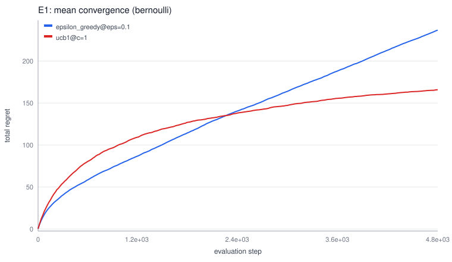

**Critic verdict: REJECT** (findings: WRONG_DIRECTION, SINGLE_COMPARATOR; reproducibility check: passed).

### E2 — `ex_9088m7bkhfkw`

- Task: `rastrigin` (rastrigin@4000); variants: `differential_evolution@CR=0.9,F=0.7,pop_size=32`, `simulated_annealing@alpha=0.995,sigma_scale=0.05,t0=1`
- Seeds: 30 per variant (root seed `4274619058`); status: **COMPLETED**
- Predicted winner: `differential_evolution@CR=0.9,F=0.7,pop_size=32`

| Variant | mean | sd |
|---|---|---|
| `differential_evolution@CR=0.9,F=0.7,pop_size=32` | 31.55 | 5.25 |
| `simulated_annealing@alpha=0.995,sigma_scale=0.05,t0=1` | 66.47 | 8.57 |

`simulated_annealing@alpha=0.995,sigma_scale=0.05,t0=1` vs reference `differential_evolution@CR=0.9,F=0.7,pop_size=32`: Δ(mean_b−mean_a)=-34.92, CI95=[-38.13, -31.62], adjusted p=1.32e-18, d=-4.91 → **significant** (n=30/variant; `paired_t(df=29)`).

*(evidence: `ex_9088m7bkhfkw`)*

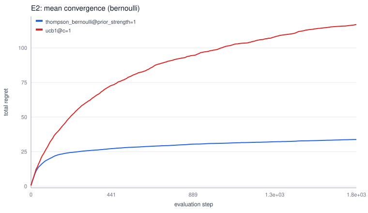

**Critic verdict: ACCEPT** (findings: SINGLE_COMPARATOR; reproducibility check: passed).

### E3 — `ex_31044408f4tm`

- Task: `sphere` (sphere@1500); variants: `random_search`, `simulated_annealing@alpha=0.995,sigma_scale=0.05,t0=1`
- Seeds: 24 per variant (root seed `4212910010`); status: **COMPLETED**
- Predicted winner: `random_search`

| Variant | mean | sd |
|---|---|---|
| `random_search` | 9.803 | 2.46 |
| `simulated_annealing@alpha=0.995,sigma_scale=0.05,t0=1` | 17.87 | 6.03 |

`random_search` vs reference `simulated_annealing@alpha=0.995,sigma_scale=0.05,t0=1`: Δ(mean_b−mean_a)=+8.063, CI95=[+5.512, +10.54], adjusted p=2.03e-06, d=1.75 → **significant** (n=24/variant; `paired_t(df=23)`).

*(evidence: `ex_31044408f4tm`)*

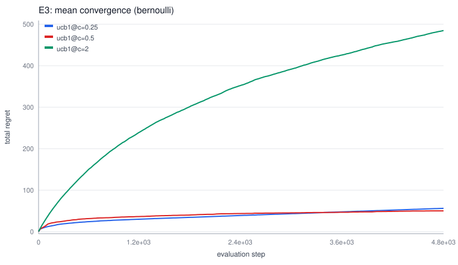

**Critic verdict: ACCEPT** (findings: SINGLE_COMPARATOR; reproducibility check: passed).

### E4 — `ex_5537caaxbedz`

- Task: `sphere` (sphere@6000); variants: `random_search`, `simulated_annealing@alpha=0.995,sigma_scale=0.05,t0=1`
- Seeds: 24 per variant (root seed `2408318434`); status: **COMPLETED**
- Predicted winner: `random_search`

| Variant | mean | sd |
|---|---|---|
| `random_search` | 6.977 | 1.88 |
| `simulated_annealing@alpha=0.995,sigma_scale=0.05,t0=1` | 14.03 | 3.09 |

`random_search` vs reference `simulated_annealing@alpha=0.995,sigma_scale=0.05,t0=1`: Δ(mean_b−mean_a)=+7.049, CI95=[+5.635, +8.406], adjusted p=1.45e-09, d=2.76 → **significant** (n=24/variant; `paired_t(df=23)`).

*(evidence: `ex_5537caaxbedz`)*

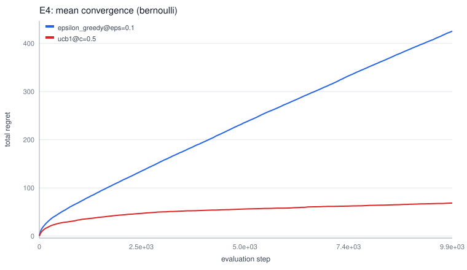

**Critic verdict: ACCEPT** (findings: SINGLE_COMPARATOR; reproducibility check: passed).

### E5 — `ex_8199qwm6va8w`

- Task: `rosenbrock` (rosenbrock@1500); variants: `random_search`, `simulated_annealing@alpha=0.995,sigma_scale=0.05,t0=1`
- Seeds: 24 per variant (root seed `1265936665`); status: **COMPLETED**
- Predicted winner: `random_search`

| Variant | mean | sd |
|---|---|---|
| `simulated_annealing@alpha=0.995,sigma_scale=0.05,t0=1` | 55.61 | 22.6 |
| `random_search` | 161.3 | 56 |

`random_search` vs reference `simulated_annealing@alpha=0.995,sigma_scale=0.05,t0=1`: Δ(mean_b−mean_a)=-105.7, CI95=[-124.6, -84.89], adjusted p=6.7e-10, d=-2.48 → **significant** (n=24/variant; `paired_t(df=23)`).

*(evidence: `ex_8199qwm6va8w`)*

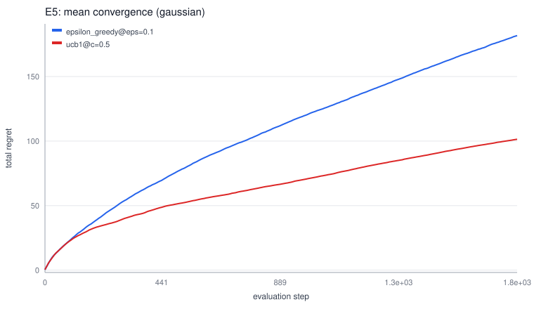

**Critic verdict: REJECT** (findings: WRONG_DIRECTION, SINGLE_COMPARATOR; reproducibility check: passed).

### E6 — `ex_0601e21mp9az`

- Task: `rosenbrock` (rosenbrock@6000); variants: `random_search`, `simulated_annealing@alpha=0.995,sigma_scale=0.05,t0=1`
- Seeds: 24 per variant (root seed `299689938`); status: **COMPLETED**
- Predicted winner: `random_search`

| Variant | mean | sd |
|---|---|---|
| `simulated_annealing@alpha=0.995,sigma_scale=0.05,t0=1` | 36.13 | 12.5 |
| `random_search` | 114.3 | 43.5 |

`random_search` vs reference `simulated_annealing@alpha=0.995,sigma_scale=0.05,t0=1`: Δ(mean_b−mean_a)=-78.19, CI95=[-97.55, -60.02], adjusted p=5.93e-08, d=-2.44 → **significant** (n=24/variant; `paired_t(df=23)`).

*(evidence: `ex_0601e21mp9az`)*

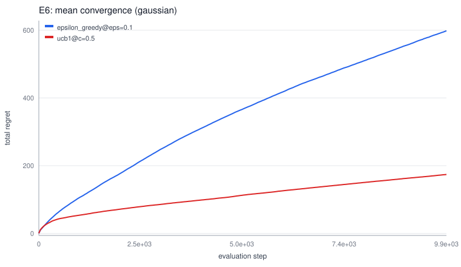

**Critic verdict: REJECT** (findings: WRONG_DIRECTION, SINGLE_COMPARATOR; reproducibility check: passed).

### E7 — `ex_3799kamsghgj`

- Task: `rastrigin` (rastrigin@1500); variants: `random_search`, `simulated_annealing@alpha=0.995,sigma_scale=0.05,t0=1`
- Seeds: 24 per variant (root seed `15242819`); status: **COMPLETED**
- Predicted winner: `random_search`

| Variant | mean | sd |
|---|---|---|
| `random_search` | 56.97 | 7.46 |
| `simulated_annealing@alpha=0.995,sigma_scale=0.05,t0=1` | 74.73 | 10.4 |

`random_search` vs reference `simulated_annealing@alpha=0.995,sigma_scale=0.05,t0=1`: Δ(mean_b−mean_a)=+17.75, CI95=[+12.8, +22.59], adjusted p=8.42e-07, d=1.96 → **significant** (n=24/variant; `paired_t(df=23)`).

*(evidence: `ex_3799kamsghgj`)*

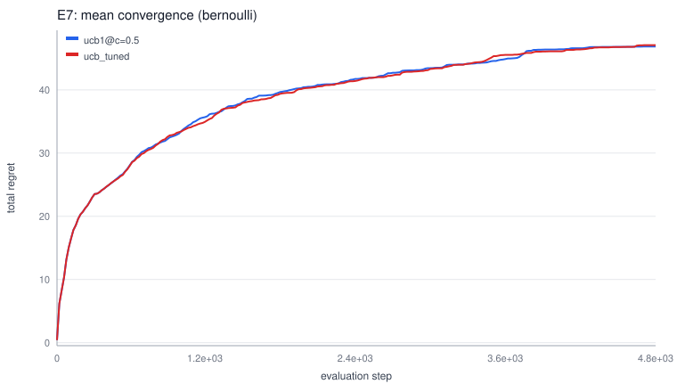

**Critic verdict: ACCEPT** (findings: SINGLE_COMPARATOR; reproducibility check: passed).

### E8 — `ex_6362mwkd23fe`

- Task: `rastrigin` (rastrigin@6000); variants: `random_search`, `simulated_annealing@alpha=0.995,sigma_scale=0.05,t0=1`
- Seeds: 24 per variant (root seed `988032550`); status: **COMPLETED**
- Predicted winner: `random_search`

| Variant | mean | sd |
|---|---|---|
| `random_search` | 47.95 | 6.77 |
| `simulated_annealing@alpha=0.995,sigma_scale=0.05,t0=1` | 64.17 | 7.52 |

`random_search` vs reference `simulated_annealing@alpha=0.995,sigma_scale=0.05,t0=1`: Δ(mean_b−mean_a)=+16.22, CI95=[+12.63, +19.85], adjusted p=1.65e-08, d=2.27 → **significant** (n=24/variant; `paired_t(df=23)`).

*(evidence: `ex_6362mwkd23fe`)*

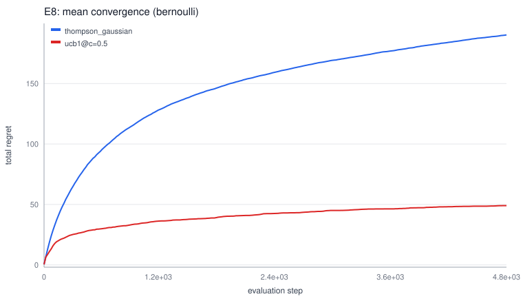

**Critic verdict: ACCEPT** (findings: SINGLE_COMPARATOR; reproducibility check: passed).

### E9 — `ex_9749k66mcemt`

- Task: `ackley` (ackley@1500); variants: `random_search`, `simulated_annealing@alpha=0.995,sigma_scale=0.05,t0=1`
- Seeds: 24 per variant (root seed `1863185648`); status: **COMPLETED**
- Predicted winner: `random_search`

| Variant | mean | sd |
|---|---|---|
| `random_search` | 5.325 | 0.631 |
| `simulated_annealing@alpha=0.995,sigma_scale=0.05,t0=1` | 7.225 | 0.703 |

`random_search` vs reference `simulated_annealing@alpha=0.995,sigma_scale=0.05,t0=1`: Δ(mean_b−mean_a)=+1.9, CI95=[+1.605, +2.224], adjusted p=5.15e-11, d=2.84 → **significant** (n=24/variant; `paired_t(df=23)`).

*(evidence: `ex_9749k66mcemt`)*

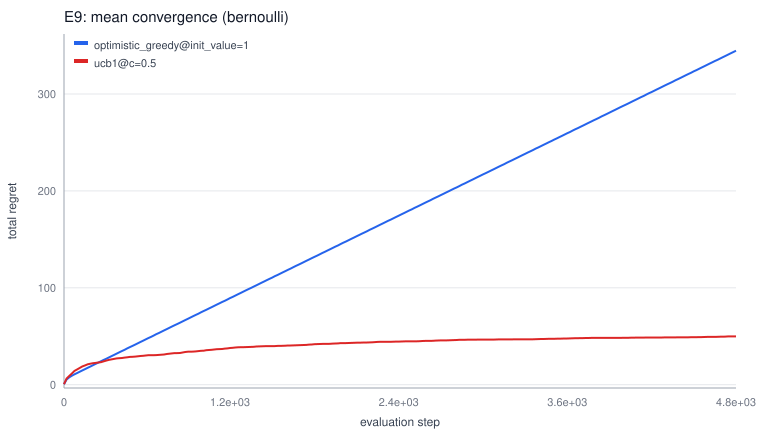

**Critic verdict: ACCEPT** (findings: SINGLE_COMPARATOR; reproducibility check: passed).

### E10 — `ex_22324npykes2`

- Task: `ackley` (ackley@6000); variants: `random_search`, `simulated_annealing@alpha=0.995,sigma_scale=0.05,t0=1`
- Seeds: 24 per variant (root seed `1983839840`); status: **COMPLETED**
- Predicted winner: `random_search`

| Variant | mean | sd |
|---|---|---|
| `random_search` | 5.136 | 0.495 |
| `simulated_annealing@alpha=0.995,sigma_scale=0.05,t0=1` | 6.026 | 0.855 |

`random_search` vs reference `simulated_annealing@alpha=0.995,sigma_scale=0.05,t0=1`: Δ(mean_b−mean_a)=+0.8899, CI95=[+0.5482, +1.229], adjusted p=4.21e-05, d=1.27 → **significant** (n=24/variant; `paired_t(df=23)`).

*(evidence: `ex_22324npykes2`)*

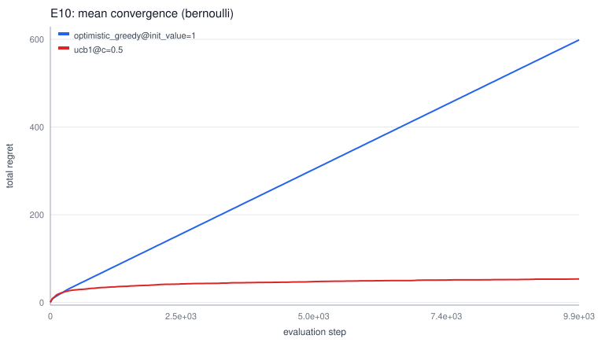

**Critic verdict: ACCEPT** (findings: SINGLE_COMPARATOR; reproducibility check: passed).

### E11 — `ex_53015wbfkjnj`

- Task: `sphere` (sphere@4000); variants: `hill_climb@sigma=0.3`, `random_search`
- Seeds: 24 per variant (root seed `1720729520`); status: **COMPLETED**

| Variant | mean | sd |
|---|---|---|
| `hill_climb@sigma=0.3` | 0.05534 | 0.0193 |
| `random_search` | 8.523 | 1.99 |

`hill_climb@sigma=0.3` vs reference `random_search`: Δ(mean_b−mean_a)=+8.468, CI95=[+7.741, +9.27], adjusted p=1.95e-16, d=6.03 → **significant** (n=24/variant; `paired_t(df=23)`).

*(evidence: `ex_53015wbfkjnj`)*

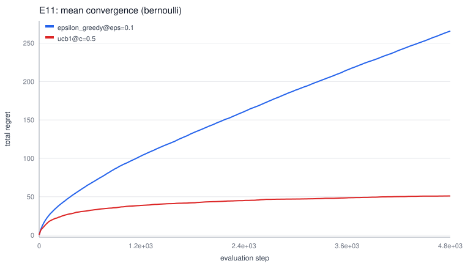

**Critic verdict: ACCEPT** (findings: SINGLE_COMPARATOR; reproducibility check: passed).

### E12 — `ex_80220wag7082`

- Task: `sphere` (sphere@4000); variants: `hill_climb@sigma=0.1`, `hill_climb@sigma=0.3`, `hill_climb@sigma=0.6`
- Seeds: 24 per variant (root seed `348632803`); status: **COMPLETED**
- Predicted winner: `hill_climb@sigma=0.1`

| Variant | mean | sd |
|---|---|---|
| `hill_climb@sigma=0.1` | 0.006752 | 0.00201 |
| `hill_climb@sigma=0.3` | 0.05957 | 0.013 |
| `hill_climb@sigma=0.6` | 0.2222 | 0.0729 |

`hill_climb@sigma=0.1` vs reference `hill_climb@sigma=0.3`: Δ(mean_b−mean_a)=+0.05282, CI95=[+0.04737, +0.05776], adjusted p=2.58e-15, d=5.68 → **significant** (n=24/variant; `paired_t(df=23)`).

*(evidence: `ex_80220wag7082`)*

`hill_climb@sigma=0.6` vs reference `hill_climb@sigma=0.3`: Δ(mean_b−mean_a)=-0.1626, CI95=[-0.1902, -0.134], adjusted p=8.45e-11, d=-3.10 → **significant** (n=24/variant; `paired_t(df=23)`).

*(evidence: `ex_80220wag7082`)*

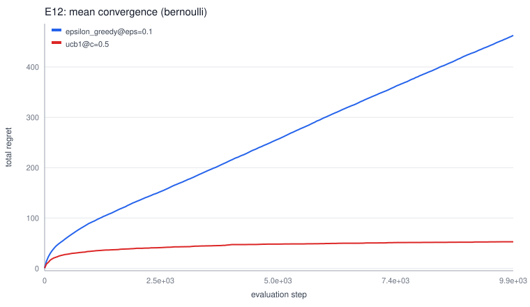

**Critic verdict: ACCEPT** (findings: none; reproducibility check: passed).

### E13 — `ex_25747jz87qny`

- Task: `sphere` (sphere@4000); variants: `hill_climb@sigma=0.1`, `hill_climb_adaptive@sigma0=0.5`
- Seeds: 24 per variant (root seed `1830261486`); status: **COMPLETED**

| Variant | mean | sd |
|---|---|---|
| `hill_climb_adaptive@sigma0=0.5` | 0 | 8.6e-09 |
| `hill_climb@sigma=0.1` | 0.005825 | 0.0014 |

`hill_climb_adaptive@sigma0=0.5` vs reference `hill_climb@sigma=0.1`: Δ(mean_b−mean_a)=+0.005825, CI95=[+0.0053, +0.006383], adjusted p=3.05e-16, d=5.90 → **significant** (n=24/variant; `paired_t(df=23)`).

*(evidence: `ex_25747jz87qny`)*

**Critic verdict: ACCEPT** (findings: SINGLE_COMPARATOR; reproducibility check: passed).

### E14 — `ex_6544vg7c0dd9`

- Task: `sphere` (sphere@4000); variants: `hill_climb_adaptive@sigma0=0.2`, `hill_climb_adaptive@sigma0=0.5`, `hill_climb_adaptive@sigma0=1`
- Seeds: 24 per variant (root seed `1825882191`); status: **COMPLETED**
- Predicted winner: `hill_climb_adaptive@sigma0=0.2`

| Variant | mean | sd |
|---|---|---|
| `hill_climb_adaptive@sigma0=1` | 0 | 8.6e-09 |
| `hill_climb_adaptive@sigma0=0.2` | 0 | 8.85e-09 |
| `hill_climb_adaptive@sigma0=0.5` | 0 | 9.78e-09 |

`hill_climb_adaptive@sigma0=0.2` vs reference `hill_climb_adaptive@sigma0=0.5`: Δ(mean_b−mean_a)=+0, CI95=[-0, +0], adjusted p=0.192, d=0.45 → **not significant** (n=24/variant; `paired_t(df=23)`).

*(evidence: `ex_6544vg7c0dd9`)*

`hill_climb_adaptive@sigma0=1` vs reference `hill_climb_adaptive@sigma0=0.5`: Δ(mean_b−mean_a)=+0, CI95=[-0, +0], adjusted p=0.192, d=0.54 → **not significant** (n=24/variant; `paired_t(df=23)`).

*(evidence: `ex_6544vg7c0dd9`)*

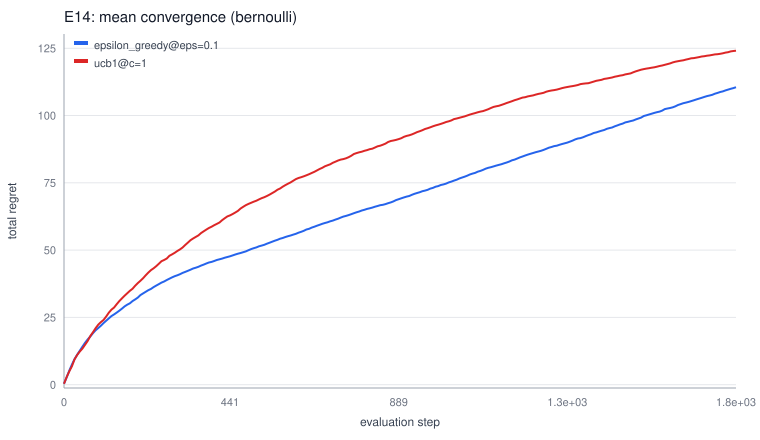

**Critic verdict: REVISE** (findings: CI_INCLUDES_ZERO, SMALL_SAMPLE; reproducibility check: passed).

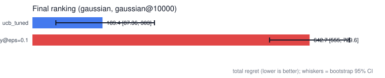

## Discussion

Across the session, `hill_climb_adaptive@sigma0=0.5` posted the strongest mean final_regret (0) in `ex_25747jz87qny`; within its own experiment it was compared under Holm-corrected paired inference against the baseline.

Negative results constrain the hypothesis space and are retained: H1 (falsified by `ex_5779ddqhmtt9`); H5 (falsified by `ex_8199qwm6va8w`); H6 (falsified by `ex_0601e21mp9az`). In falsification-driven autonomous research a refutation is an outcome of equal informational value to a confirmation.

9 of the supported hypotheses were derived from prior results (sweeps, transfers, replications, head-to-heads) rather than prior belief: the session's knowledge grew out of its own measurements.

Reproducibility audits passed on 14/14 critiqued experiments (sampled runs re-executed from scratch; result hashes compared byte-for-byte).
## Limitations and Threats to Validity

- **SINGLE_COMPARATOR:** Several conclusions rest on single-opponent comparisons; ranking robustness against broader competitor pools is unverified.
- **SMALL_SAMPLE:** Some comparisons ran with limited seeds; their intervals are wide.
- Environments are synthetic benchmark families defined inside the lab's domain plugins; external validity beyond these families is not claimed.
- All reasoning in this session used the deterministic 'heuristic' strategy engine (no language model), which bounds the creativity of hypothesis selection to its strategy ladder.
- Experiment isolation used local subprocess sandboxes (rlimit+timeout), which do not provide network isolation; kernels shipped with the lab perform no I/O beyond their workdir.

## Conclusion

- H2 stands: Differential evolution outperforms simulated annealing on the multimodal rastrigin landscape (dim=8, evals=4000). *(supported by `ex_9088m7bkhfkw`).*
- H3 stands: The champion's standing transfers to sphere at evals=1500 without retuning: random_search stays ahead of simulated_annealing@alpha=0.995,sigma_scale=0.05,t0=1 (rival). *(supported by `ex_31044408f4tm`).*
- H4 stands: The champion's standing transfers to sphere at evals=6000 without retuning: random_search stays ahead of simulated_annealing@alpha=0.995,sigma_scale=0.05,t0=1 (rival). *(supported by `ex_5537caaxbedz`).*
- H7 stands: The champion's standing transfers to rastrigin at evals=1500 without retuning: random_search stays ahead of simulated_annealing@alpha=0.995,sigma_scale=0.05,t0=1 (rival). *(supported by `ex_3799kamsghgj`).*
- H8 stands: The champion's standing transfers to rastrigin at evals=6000 without retuning: random_search stays ahead of simulated_annealing@alpha=0.995,sigma_scale=0.05,t0=1 (rival). *(supported by `ex_6362mwkd23fe`).*
- H9 stands: The champion's standing transfers to ackley at evals=1500 without retuning: random_search stays ahead of simulated_annealing@alpha=0.995,sigma_scale=0.05,t0=1 (rival). *(supported by `ex_9749k66mcemt`).*
- H10 stands: The champion's standing transfers to ackley at evals=6000 without retuning: random_search stays ahead of simulated_annealing@alpha=0.995,sigma_scale=0.05,t0=1 (rival). *(supported by `ex_22324npykes2`).*
- H11 stands: hill_climb@sigma=0.3 challenges champion random_search on its own home ground (sphere, sphere@4000). *(supported by `ex_53015wbfkjnj`).*
- H12 stands: Tuning sigma materially changes hill_climb performance: at least one of ['hill_climb@sigma=0.1', 'hill_climb@sigma=0.6'] beats the incumbent setting (hill_climb@sigma=0.3, mean 0.05534). *(supported by `ex_80220wag7082`).*
- H13 stands: hill_climb_adaptive@sigma0=0.5 challenges champion hill_climb@sigma=0.1 on its own home ground (sphere, sphere@4000). *(supported by `ex_25747jz87qny`).*
- H1 was falsified: Simulated annealing with geometric cooling (t0=1, alpha=0.995) achieves lower mean final regret than random search on the unimodal sphere function (dim=8) at budget evals=4000. *(refuted by `ex_5779ddqhmtt9`).*
- H5 was falsified: The champion's standing transfers to rosenbrock at evals=1500 without retuning: random_search stays ahead of simulated_annealing@alpha=0.995,sigma_scale=0.05,t0=1 (rival). *(refuted by `ex_8199qwm6va8w`).*
- H6 was falsified: The champion's standing transfers to rosenbrock at evals=6000 without retuning: random_search stays ahead of simulated_annealing@alpha=0.995,sigma_scale=0.05,t0=1 (rival). *(refuted by `ex_0601e21mp9az`).*

## Future Work

- Literature gap worth pursuing: Literature coverage is thin on 'solver' (question frequency 2, corpus coverage 10%). Candidate angle for experimentation.
- Literature gap worth pursuing: Literature coverage is thin on 'which' (question frequency 1, corpus coverage 0%). Candidate angle for experimentation.
- Literature gap worth pursuing: Literature coverage is thin on 'minimizes' (question frequency 1, corpus coverage 0%). Candidate angle for experimentation.
- Extend sessions with LLM-assisted narration once API credentials are configured; numeric claims would remain database-derived.

## Provenance and Traceability

| Artifact | Where |
|---|---|
| Session record | `sessions` table row `rs_56945a960cjc` |
| Raw runs | `runs` table, 744 rows |
| Kernel code hashes | `experiments.code_version` |
| Config snapshots | artifact dirs under the session root |
| This document | generated by `rlab.reports.paper.PaperGenerator` |

**Claim → evidence index**

1. (observational) hill_climb_adaptive@sigma0=0.5 achieved the best session-wide mean final_regret. → evidence: `ex_25747jz87qny`
2. (significant_comparison) `simulated_annealing@alpha=0.995,sigma_scale=0.05,t0=1` vs reference `random_search`: Δ(mean_b−mean_a)=-6.21, CI95=[-8.27, -4.188], adjusted p=1.47e-06, d=-1.74 → evidence: `ex_5779ddqhmtt9`
3. (significant_comparison) `simulated_annealing@alpha=0.995,sigma_scale=0.05,t0=1` vs reference `differential_evolution@CR=0.9,F=0.7,pop_size=32`: Δ(mean_b−mean_a)=-34.92, CI95=[-38.13, - → evidence: `ex_9088m7bkhfkw`
4. (significant_comparison) `random_search` vs reference `simulated_annealing@alpha=0.995,sigma_scale=0.05,t0=1`: Δ(mean_b−mean_a)=+8.063, CI95=[+5.512, +10.54], adjusted p=2.03e-06, d=1.7 → evidence: `ex_31044408f4tm`
5. (significant_comparison) `random_search` vs reference `simulated_annealing@alpha=0.995,sigma_scale=0.05,t0=1`: Δ(mean_b−mean_a)=+7.049, CI95=[+5.635, +8.406], adjusted p=1.45e-09, d=2.7 → evidence: `ex_5537caaxbedz`
6. (significant_comparison) `random_search` vs reference `simulated_annealing@alpha=0.995,sigma_scale=0.05,t0=1`: Δ(mean_b−mean_a)=-105.7, CI95=[-124.6, -84.89], adjusted p=6.7e-10, d=-2.4 → evidence: `ex_8199qwm6va8w`
7. (significant_comparison) `random_search` vs reference `simulated_annealing@alpha=0.995,sigma_scale=0.05,t0=1`: Δ(mean_b−mean_a)=-78.19, CI95=[-97.55, -60.02], adjusted p=5.93e-08, d=-2. → evidence: `ex_0601e21mp9az`
8. (significant_comparison) `random_search` vs reference `simulated_annealing@alpha=0.995,sigma_scale=0.05,t0=1`: Δ(mean_b−mean_a)=+17.75, CI95=[+12.8, +22.59], adjusted p=8.42e-07, d=1.96 → evidence: `ex_3799kamsghgj`
9. (significant_comparison) `random_search` vs reference `simulated_annealing@alpha=0.995,sigma_scale=0.05,t0=1`: Δ(mean_b−mean_a)=+16.22, CI95=[+12.63, +19.85], adjusted p=1.65e-08, d=2.2 → evidence: `ex_6362mwkd23fe`
10. (significant_comparison) `random_search` vs reference `simulated_annealing@alpha=0.995,sigma_scale=0.05,t0=1`: Δ(mean_b−mean_a)=+1.9, CI95=[+1.605, +2.224], adjusted p=5.15e-11, d=2.84  → evidence: `ex_9749k66mcemt`
11. (significant_comparison) `random_search` vs reference `simulated_annealing@alpha=0.995,sigma_scale=0.05,t0=1`: Δ(mean_b−mean_a)=+0.8899, CI95=[+0.5482, +1.229], adjusted p=4.21e-05, d=1 → evidence: `ex_22324npykes2`
12. (significant_comparison) `hill_climb@sigma=0.3` vs reference `random_search`: Δ(mean_b−mean_a)=+8.468, CI95=[+7.741, +9.27], adjusted p=1.95e-16, d=6.03 → **significant** (n=24/variant; → evidence: `ex_53015wbfkjnj`
13. (significant_comparison) `hill_climb@sigma=0.1` vs reference `hill_climb@sigma=0.3`: Δ(mean_b−mean_a)=+0.05282, CI95=[+0.04737, +0.05776], adjusted p=2.58e-15, d=5.68 → **significant**  → evidence: `ex_80220wag7082`
14. (significant_comparison) `hill_climb@sigma=0.6` vs reference `hill_climb@sigma=0.3`: Δ(mean_b−mean_a)=-0.1626, CI95=[-0.1902, -0.134], adjusted p=8.45e-11, d=-3.10 → **significant** (n= → evidence: `ex_80220wag7082`
15. (significant_comparison) `hill_climb_adaptive@sigma0=0.5` vs reference `hill_climb@sigma=0.1`: Δ(mean_b−mean_a)=+0.005825, CI95=[+0.0053, +0.006383], adjusted p=3.05e-16, d=5.90 → **sig → evidence: `ex_25747jz87qny`
16. (non_significant_comparison) `hill_climb_adaptive@sigma0=0.2` vs reference `hill_climb_adaptive@sigma0=0.5`: Δ(mean_b−mean_a)=+0, CI95=[-0, +0], adjusted p=0.192, d=0.45 → **not significant → evidence: `ex_6544vg7c0dd9`
17. (non_significant_comparison) `hill_climb_adaptive@sigma0=1` vs reference `hill_climb_adaptive@sigma0=0.5`: Δ(mean_b−mean_a)=+0, CI95=[-0, +0], adjusted p=0.192, d=0.54 → **not significant** → evidence: `ex_6544vg7c0dd9`
18. (hypothesis_resolution) Differential evolution outperforms simulated annealing on the multimodal rastrigin landscape (dim=8, evals=4000). → evidence: `ex_9088m7bkhfkw`
19. (hypothesis_resolution) The champion's standing transfers to sphere at evals=1500 without retuning: random_search stays ahead of simulated_annealing@alpha=0.995,sigma_scale=0.05,t0=1 ( → evidence: `ex_31044408f4tm`
20. (hypothesis_resolution) The champion's standing transfers to sphere at evals=6000 without retuning: random_search stays ahead of simulated_annealing@alpha=0.995,sigma_scale=0.05,t0=1 ( → evidence: `ex_5537caaxbedz`
21. (hypothesis_resolution) The champion's standing transfers to rastrigin at evals=1500 without retuning: random_search stays ahead of simulated_annealing@alpha=0.995,sigma_scale=0.05,t0= → evidence: `ex_3799kamsghgj`
22. (hypothesis_resolution) The champion's standing transfers to rastrigin at evals=6000 without retuning: random_search stays ahead of simulated_annealing@alpha=0.995,sigma_scale=0.05,t0= → evidence: `ex_6362mwkd23fe`
23. (hypothesis_resolution) The champion's standing transfers to ackley at evals=1500 without retuning: random_search stays ahead of simulated_annealing@alpha=0.995,sigma_scale=0.05,t0=1 ( → evidence: `ex_9749k66mcemt`
24. (hypothesis_resolution) The champion's standing transfers to ackley at evals=6000 without retuning: random_search stays ahead of simulated_annealing@alpha=0.995,sigma_scale=0.05,t0=1 ( → evidence: `ex_22324npykes2`
25. (hypothesis_resolution) hill_climb@sigma=0.3 challenges champion random_search on its own home ground (sphere, sphere@4000). → evidence: `ex_53015wbfkjnj`
26. (hypothesis_resolution) Tuning sigma materially changes hill_climb performance: at least one of ['hill_climb@sigma=0.1', 'hill_climb@sigma=0.6'] beats the incumbent setting (hill_climb → evidence: `ex_80220wag7082`
27. (hypothesis_resolution) hill_climb_adaptive@sigma0=0.5 challenges champion hill_climb@sigma=0.1 on its own home ground (sphere, sphere@4000). → evidence: `ex_25747jz87qny`
28. (hypothesis_resolution) Simulated annealing with geometric cooling (t0=1, alpha=0.995) achieves lower mean final regret than random search on the unimodal sphere function (dim=8) at bu → evidence: `ex_5779ddqhmtt9`
29. (hypothesis_resolution) The champion's standing transfers to rosenbrock at evals=1500 without retuning: random_search stays ahead of simulated_annealing@alpha=0.995,sigma_scale=0.05,t0 → evidence: `ex_8199qwm6va8w`
30. (hypothesis_resolution) The champion's standing transfers to rosenbrock at evals=6000 without retuning: random_search stays ahead of simulated_annealing@alpha=0.995,sigma_scale=0.05,t0 → evidence: `ex_0601e21mp9az`
